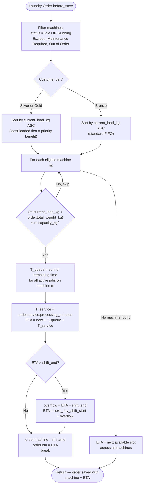

# Business Logic — ETA & Machine Allocation

**File:** `spinly/logic/eta_calc.py`
**Triggered by:** `Laundry Order → before_save`

The ETA engine assigns a machine to each order and calculates the estimated completion time, factoring in current machine load, service duration, and shift boundaries.

---

## Algorithm Flowchart



---

## Formula

$$ETA = T_{now} + T_{queue} + T_{service}$$

| Variable | Source |
|---|---|
| $T_{now}$ | Current datetime |
| $T_{queue}$ | Sum of remaining processing time for all active Job Cards on the selected machine |
| $T_{service}$ | `Laundry Service.processing_minutes` |

---

## Machine Eligibility Rules

| Status | Eligible for Allocation? |
|---|---|
| `Idle` | ✅ Yes |
| `Running` | ✅ Yes (has capacity remaining) |
| `Maintenance Required` | ❌ No |
| `Out of Order` | ❌ No |

---

## Tier Priority Benefit

| Tier | Sort Behaviour | Result |
|---|---|---|
| Bronze | Sort eligible machines by `current_load_kg` ASC | Standard FIFO allocation |
| Silver | Sort eligible machines by `current_load_kg` ASC | Same sort, but Silver/Gold customers are processed before Bronze in concurrent situations |
| Gold | Sort eligible machines by `current_load_kg` ASC | Least-loaded machine → lowest T_queue → earliest ETA |

> The tier benefit is that Silver/Gold customers get assigned to the least-loaded machine, which directly reduces T_queue and therefore ETA. Bronze customers are sorted the same way but receive no special queue priority treatment at the application level.

---

## Shift Overflow Logic

```
shift_end = shift_start + shift_duration_hrs (from Spinly Settings)

if ETA > shift_end:
    overflow = ETA - shift_end
    ETA = next_day_shift_start + overflow
```

**Example:** Shift ends at 20:00. Order ETA calculated as 20:30.
→ overflow = 30 min
→ ETA = next day 08:00 + 30 min = 08:30

---

## Capacity Check

```
if (machine.current_load_kg + order.total_weight_kg) <= machine.capacity_kg:
    # machine is eligible — proceed with ETA calculation
else:
    # skip this machine, try next
```

---

## Fallback: No Machine Available

If no machine passes the capacity check:
- ETA = next available slot across all eligible machines (the one that frees up soonest)
- This is calculated by finding the machine with the earliest `countdown_timer_end`

---

## Machine Countdown Update (`spinly/logic/machine.py`)

**Triggered:** `Laundry Job Card → on_update` when `workflow_state → Running`

```python
def update_countdown(doc, method):
    if doc.workflow_state == "Running":
        machine = frappe.get_doc("Laundry Machine", doc.machine)
        machine.status = "Running"
        machine.countdown_timer_end = doc.machine_countdown_end
        machine.save()
```

This keeps `Laundry Machine.countdown_timer_end` in sync so the ETA engine's T_queue calculation is always accurate.

---

## Settings Used

| Setting | Field | Default |
|---|---|---|
| Shift start | `Spinly Settings.shift_start` | e.g. `08:00` |
| Shift duration | `Spinly Settings.shift_duration_hrs` | `10` |

---

## Anti-Patterns

- ❌ Never set ETA manually — always let `eta_calc.calculate` do it
- ❌ Never allocate a machine in `Maintenance Required` or `Out of Order` status
- ❌ Never skip the capacity check — double-allocation corrupts T_queue
- ❌ ETA overflow must never produce an ETA on a non-working day (Phase 1 assumes next calendar day is a working day)

---

## Related
- [[01 - Order Flow/_Index]]
- [[01 - Order Flow/Data Model]]
- [[01 - Order Flow/Testing]]
- [[05 - Configuration & Masters/Data Model]]
- [[🔗 Hook Map]]
