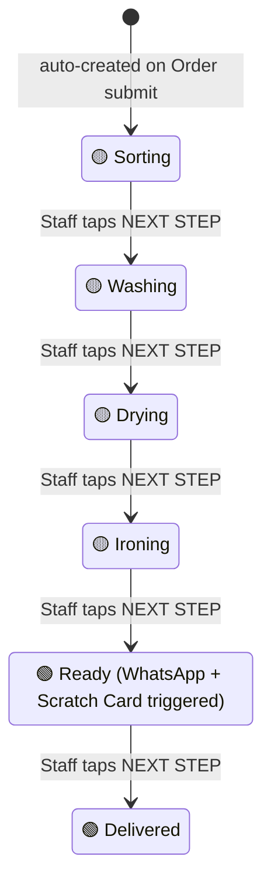
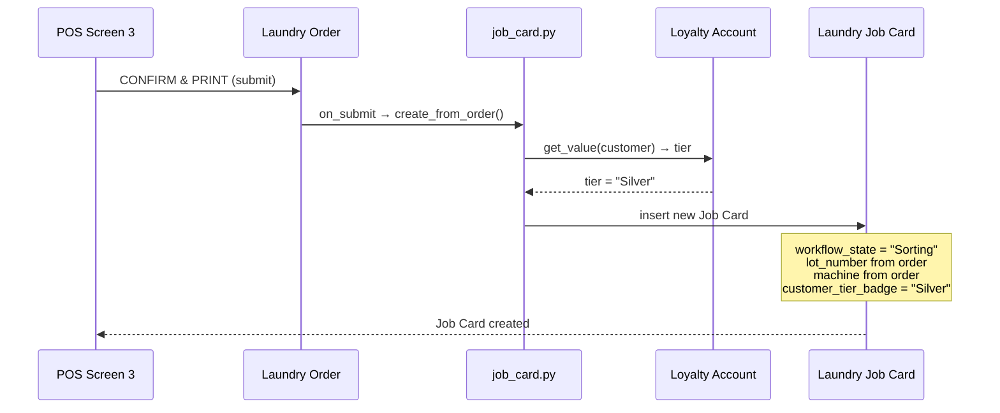
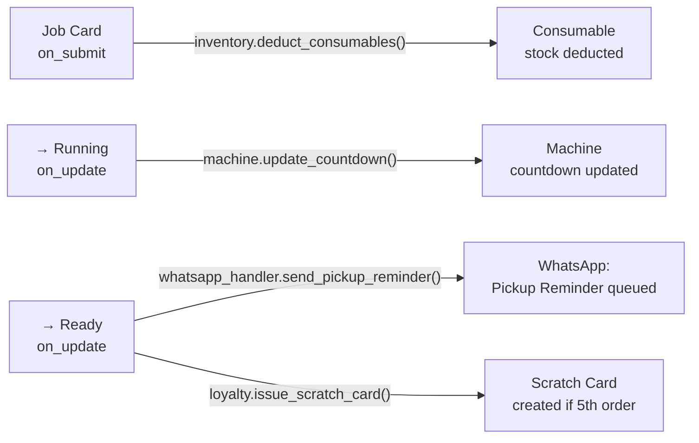

# Business Logic — Job Card Lifecycle

**File:** `spinly/logic/job_card.py`
**Triggered by:** `Laundry Order → on_submit`

The Job Card is the internal tracking document for each order. It is auto-created when an order is submitted and progresses through a 6-state workflow until delivery.

---

## Job Card Workflow States



---

## Auto-Creation Sequence



---

## create_from_order() — Full Logic

```python
def create_from_order(order, method):
    job_card = frappe.new_doc("Laundry Job Card")
    job_card.order = order.name
    job_card.machine = order.machine          # copied from ETA engine assignment
    job_card.lot_number = order.lot_number    # displayed large on bag tag
    job_card.special_instructions = order.customer_comments
    job_card.workflow_state = "Sorting"       # always starts at first step

    # Fetch tier badge from Loyalty Account (1-to-1 with customer)
    account = frappe.db.get_value(
        "Loyalty Account",
        {"customer": order.customer},
        ["tier"],
        as_dict=True
    )
    job_card.customer_tier_badge = account.tier if account else "Bronze"

    job_card.insert(ignore_permissions=True)
```

---

## Hooks Fired at Each Workflow State



| State Transition | Hook | Function |
|---|---|---|
| Submit (any state) | `on_submit` | `inventory.deduct_consumables` — deducts stock |
| → Running | `on_update` | `machine.update_countdown` — syncs machine timer |
| → Ready | `on_update` | `whatsapp_handler.send_pickup_reminder` — notifies customer |
| → Ready | `on_update` | `loyalty.issue_scratch_card` — issues scratch card if qualifying |

---

## Scratch Card Dependency Note

`loyalty.issue_scratch_card` checks `account.order_count % settings.scratch_card_frequency == 0`.

`order_count` is incremented inside `earn_points()`, which fires on **Laundry Order → on_submit** — earlier in the same submit flow that creates the Job Card.

By the time the Job Card reaches `Ready` (which happens after multiple staff taps, not on the same submit), `order_count` is guaranteed to be up-to-date.

---

## Lot Number — Physical Bag Identification

The `lot_number` (format: `LOT-YYYY-#####`) is the primary physical identifier:
- Displayed in **very large font** on the Job Card screen
- Printed on the thermal Job Tag (80mm bag tag)
- Used by staff to match physical bag to digital record
- Never changes after order submission

---

## Tier Badge on Job Card

The `customer_tier_badge` (Bronze / Silver / Gold) is:
- Fetched from Loyalty Account at **creation time**
- Displayed prominently on the Job Card screen
- Shown on the printed Job Tag
- Ensures staff visually identify and treat Gold/Silver customers with priority

---

## Related
- [[01 - Order Flow/_Index]]
- [[01 - Order Flow/Data Model]]
- [[01 - Order Flow/Business Logic — ETA & Machine Allocation]]
- [[02 - Loyalty & Gamification/Business Logic]]
- [[03 - Inventory/Business Logic]]
- [[04 - Notifications/Business Logic]]
- [[🔗 Hook Map]]
