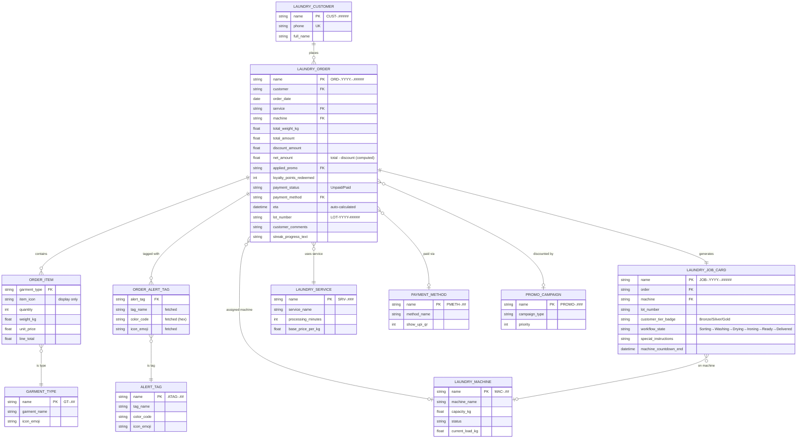

# Data Model — Order Flow

Four DocTypes define the order flow: Laundry Order (the bill), Laundry Job Card (the internal tracker), and two child tables for garment line items and alert tags.

---

## ER Diagram

---

## Laundry Order — Field Reference

| Field | Type | Description |
|---|---|---|
| `name` | Data | Auto: `ORD-.YYYY.-.#####` |
| `customer` | Link → Laundry Customer | Required |
| `order_date` | Date | Auto: today |
| `service` | Link → Laundry Service | Required (Wash & Fold / Wash & Iron / Dry Clean) |
| `machine` | Link → Laundry Machine | Set by ETA engine on `before_save` |
| `order_items` | Child Table → Order Item | One row per garment type |
| `alert_tags` | Child Table → Order Alert Tag | Warnings applied to this order |
| `total_weight_kg` | Float | Sum of order_items.weight_kg |
| `total_amount` | Currency | Sum of order_items.line_total |
| `discount_amount` | Currency | Set by promo engine or loyalty redemption |
| `net_amount` | Currency | **Computed:** `total_amount − discount_amount`. Used for loyalty points calc and invoice. |
| `applied_promo` | Link → Promo Campaign | Set by promo engine (single best promo) |
| `loyalty_points_redeemed` | Int | Points applied at checkout (POS Screen 3) |
| `payment_status` | Select | `Unpaid` / `Paid` |
| `payment_method` | Link → Payment Method | Cash / UPI / Card |
| `eta` | Datetime | Auto-calculated by ETA engine |
| `lot_number` | Data | Auto: `LOT-YYYY-#####` — displayed large on bag tag |
| `customer_comments` | Small Text | Copied to Job Card as `special_instructions` |
| `streak_progress_text` | Small Text | e.g. "3/4 weeks — 1 more for double points!" |

> **Submittable:** Once submitted, the order is locked. ETA, machine assignment, and discount are all frozen. Payment status can still be toggled post-submit.

---

## Laundry Job Card — Field Reference

| Field | Type | Description |
|---|---|---|
| `name` | Data | Auto: `JOB-.YYYY.-.#####` |
| `order` | Link → Laundry Order | The parent order |
| `machine` | Link → Laundry Machine | Copied from order on auto-creation |
| `lot_number` | Data | Copied from order — displayed in large font |
| `customer_tier_badge` | Select | Bronze / Silver / Gold — fetched from Loyalty Account at creation time |
| `workflow_state` | Select | `Sorting → Washing → Drying → Ironing → Ready → Delivered` |
| `special_instructions` | Small Text | Copied from order.customer_comments |
| `machine_countdown_end` | Datetime | Set by machine.update_countdown when Job Card hits Running |

> **Submittable:** Job Card submission triggers `inventory.deduct_consumables`.

---

## Order Item — Field Reference (Child Table)

| Field | Type | Description |
|---|---|---|
| `garment_type` | Link → Garment Type | e.g. Shirt, Saree, Bedding |
| `item_icon` | Data | Emoji fetched from Garment Type (display only) |
| `quantity` | Int | Count of items |
| `weight_kg` | Float | Weight for this line |
| `unit_price` | Currency | Price per kg from Laundry Service |
| `line_total` | Currency | Computed: `weight_kg × unit_price` |

---

## Order Alert Tag — Field Reference (Child Table)

| Field | Type | Description |
|---|---|---|
| `alert_tag` | Link → Alert Tag | e.g. Whites Only, Delicates |
| `tag_name` | Data | Fetched from Alert Tag (display only) |
| `color_code` | Data | Hex color fetched from Alert Tag |
| `icon_emoji` | Data | Emoji fetched from Alert Tag |

---

## Computed Fields

| Field | Formula | DocType |
|---|---|---|
| `net_amount` | `total_amount − discount_amount` | Laundry Order |
| `lot_number` | `LOT-YYYY-#####` (auto, like naming series) | Laundry Order |
| `customer_tier_badge` | Fetched from Loyalty Account at Job Card creation | Laundry Job Card |

---

## Naming Series

| DocType | Series | Example |
|---|---|---|
| Laundry Order | `ORD-.YYYY.-.#####` | `ORD-2026-00001` |
| Laundry Job Card | `JOB-.YYYY.-.#####` | `JOB-2026-00001` |
| Lot Number | `LOT-YYYY-#####` (custom field) | `LOT-2026-00001` |

---

## Related
- [[01 - Order Flow/_Index]]
- [[01 - Order Flow/Business Logic — ETA & Machine Allocation]]
- [[01 - Order Flow/Business Logic — Job Card Lifecycle]]
- [[05 - Configuration & Masters/Data Model]]
- [[📊 DocType Map]]
