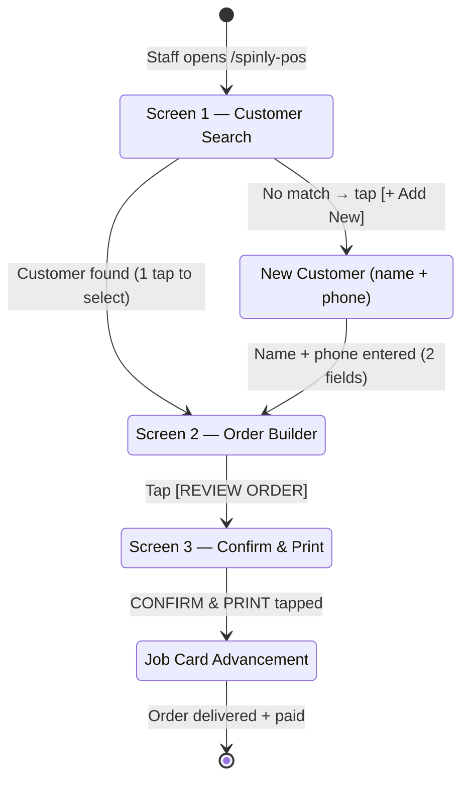

# UI — Order Flow

**File:** `spinly/page/spinly_pos/spinly_pos.html` (+ `.css`, `.js`)
**URL:** `/spinly-pos`
**Constraint:** Every returning customer order = ≤ 5 taps from home screen

---

## Screen Progression

---

## Screen 1 — Customer Search

**Purpose:** Identify returning customer by phone number. One-time new customer entry.

**Elements:**
- Large numeric keypad (digits 0–9 + backspace) — thumb-optimised, fills screen
- Phone number display field at top (shows digits as typed)
- On match: customer card slides up showing:
  - Customer name (large)
  - Tier badge: 🥉 Bronze / 🥈 Silver / 🥇 Gold
  - Total points balance
  - Priority indicator for Silver/Gold (highlighted)
- [SELECT CUSTOMER] button — 1 tap to proceed
- [+ Add New Customer] button — appears only when no match found

**New Customer Flow (≤ 7 taps exception):**
- Name field (text input)
- Phone field (already typed)
- [SAVE & CONTINUE] — creates Laundry Customer + triggers Loyalty Account creation

**Tap Count (returning customer):** Dial phone → 1 tap to select = **2 actions total** (phone entry + tap)

---

## Screen 2 — Order Builder

**Purpose:** Build the order — garments, service type, alert tags.

**Elements:**
- **Garment Icon Grid** (top section):
  - Icons loaded from Garment Type master (sorted by `sort_order`)
  - Each garment shows: emoji icon + name
  - `+` / `−` quantity buttons per garment
  - OR single total weight input field (for bulk orders)
  - Selected items highlighted with count badge
- **Service Selection** (middle strip):
  - 3 large buttons from Laundry Service master
  - Active service highlighted in blue
  - Shows price per kg for each service
- **Alert Tag Toggles** (bottom strip):
  - One button per active Alert Tag
  - Color-coded per `color_code` hex field
  - Shows `icon_emoji` + `tag_name`
  - Multi-select — tap to toggle on/off
  - Selected tags highlighted with filled background
- **Weight/Total Summary** (footer):
  - Running total weight (kg) + estimated price
  - [REVIEW ORDER] button — advances to Screen 3

**Tap Count from here:** Select garments (1–3 taps) + service (1 tap) + alert tag (optional, 1 tap) = **3–5 taps total from Screen 1**

---

## Screen 3 — Confirm & Print

**Purpose:** Final review, loyalty/promo application, order submission.

**Elements:**
- **Order Summary:**
  - Order ID (preview)
  - Lot Number
  - Machine assigned (from ETA engine)
  - ETA (date + time, large)
- **Alert Badge Strip:**
  - Large colored badges for each selected alert tag (⚠️ WHITES, ⚠️ DELICATES, etc.)
  - Bold, unmissable — staff must acknowledge before printing
- **Loyalty Prompt** (conditional — shown if customer has redeemable points):
  - "Apply 150 pts for ₹15 off?" → [YES] [NO]
  - Single tap to apply or skip
  - Updates `loyalty_points_redeemed` and `discount_amount` on confirm
- **Promo Discount** (conditional — shown if active promo applies):
  - "Flash Sale: 20% off applied" banner
  - Non-interactive — auto-applied by promo engine
- **Price Breakdown:**
  - Subtotal
  - Discount (promo or loyalty — one line)
  - **Net Total** (large)
- **[✅ CONFIRM & PRINT]** button (large, green, full-width):
  - Submits Laundry Order
  - Triggers thermal Job Tag print (80mm)
  - Triggers A4 Invoice PDF
  - Navigates to Job Card screen for this order

**Tap Count from Screen 1:** 2 (search) + 3 (build) + 1 (review) + 1 (loyalty prompt) + 1 (confirm) = **≤ 5 returning customer taps** ✅

---

## Job Card Advancement Screen

**Purpose:** Staff advances the order through workflow states. 1 tap per step.

**Elements:**
- **Lot ID** — very large font, centre of screen (primary visual anchor)
- **Machine #** — prominent (staff knows which machine to check)
- **Tier Badge** — Bronze/Silver/Gold in colour (staff treats Gold better)
- **Alert Warning Strip** — large coloured badges re-shown (⚠️ WHITES etc.)
- **Workflow Progress Bar:**
  - 6 steps shown horizontally: Sorting → Washing → Drying → Ironing → Ready → Delivered
  - Completed steps: green filled
  - Current step: yellow pulsing
  - Future steps: grey outline
- **[➡️ NEXT STEP]** button:
  - Full-width, thumb-zone (bottom of screen)
  - Yellow while order is in progress
  - Green when status reaches `Ready` ("MARK AS DELIVERED")
  - 1 tap per state advance
- **[💵 MARK AS PAID]** button:
  - Appears when `workflow_state` is `Ready` or `Delivered`
  - Toggles `payment_status` from `Unpaid` to `Paid`
  - Turns green on tap (confirmation feedback)
  - Triggers WhatsApp Payment Thanks message

**Tap Count to advance one step:** 1 tap ✅

---

## Color System

| Color | Hex | Used For |
|---|---|---|
| 🟢 Green | `#22c55e` | CONFIRM button, completed steps, Paid status, Idle machines |
| 🟡 Yellow | `#eab308` | NEXT STEP button (active), current workflow step, Running machines |
| 🔴 Red | `#ef4444` | Alert badges, Out of Order machines, Unpaid overdue |
| 🔵 Blue | `#3b82f6` | ETA display, tier badges, active service selection |

---

## Responsive Design

| Device | Layout |
|---|---|
| 10" tablet (landscape) | 2-column icon grid, large buttons |
| 10" tablet (portrait) | Single column, scrollable icon grid |
| 5" phone | Single column, icons slightly smaller, all buttons full-width |

**Thumb-zone principle:** All primary action buttons (NEXT STEP, CONFIRM, MARK AS PAID) anchored to the bottom 25% of the screen — reachable with one thumb without repositioning the device.

---

## Print Trigger

`[✅ CONFIRM & PRINT]` on Screen 3 triggers two prints simultaneously:
1. **Thermal Job Tag (80mm)** — for the physical laundry bag
2. **A4 Customer Invoice (PDF)** — for the customer receipt

See [[06 - System/Print Formats]] for full template specifications.

---

## Related
- [[01 - Order Flow/_Index]]
- [[01 - Order Flow/Business Logic — ETA & Machine Allocation]]
- [[01 - Order Flow/Business Logic — Job Card Lifecycle]]
- [[02 - Loyalty & Gamification/UI]]
- [[06 - System/Print Formats]]
- [[05 - Configuration & Masters/UI]]
