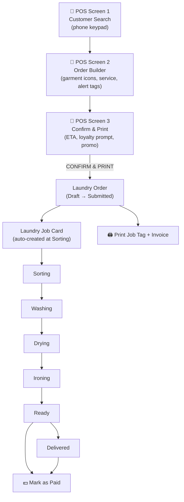

# 01 - Order Flow

The Order Flow module covers the full lifecycle of a laundry transaction: from customer identification at the POS, through order creation and machine allocation, to job card progression and final delivery with payment.

---

## Order Lifecycle

---

## Documents in this Module

| Document | Description |
|---|---|
| [[01 - Order Flow/Data Model]] | Field definitions for Laundry Order, Job Card, Order Item, Order Alert Tag |
| [[01 - Order Flow/Business Logic — ETA & Machine Allocation]] | Machine eligibility, T_queue formula, tier priority, shift overflow |
| [[01 - Order Flow/Business Logic — Job Card Lifecycle]] | Auto-creation, workflow states, hook triggers at each step |
| [[01 - Order Flow/UI]] | POS screen specs, tap counts, color system |
| [[01 - Order Flow/Testing]] | ETA tests, low-click tests, no-accounting tests |

---

## Key DocTypes

| DocType | Naming | Role |
|---|---|---|
| Laundry Order | `ORD-.YYYY.-.#####` | Primary transactional document (Submittable) |
| Laundry Job Card | `JOB-.YYYY.-.#####` | Internal tracking bucket (auto-created) |
| Order Item | child | Per-garment line items |
| Order Alert Tag | child | Warning tags (whites, delicates, etc.) |

---

## Hooks Summary

| Event | Trigger | Function |
|---|---|---|
| Laundry Order `before_save` | Every save | `eta_calc.calculate` + `loyalty.apply_best_discount` |
| Laundry Order `on_submit` | Submit | `job_card.create_from_order` + `loyalty.earn_points` + WhatsApp confirmation |
| Laundry Order `on_update` | Paid transition | WhatsApp payment thanks (guard: Unpaid→Paid only) |
| Laundry Job Card `on_submit` | Submit | `inventory.deduct_consumables` |
| Laundry Job Card `on_update` | →Running | `machine.update_countdown` |
| Laundry Job Card `on_update` | →Ready | WhatsApp pickup reminder + `loyalty.issue_scratch_card` |

---

## Related
- [[🏠 Spinly — Master Index]]
- [[🔗 Hook Map]]
- [[📊 DocType Map]]
- [[02 - Loyalty & Gamification/_Index]]
- [[03 - Inventory/_Index]]
- [[05 - Configuration & Masters/_Index]]
