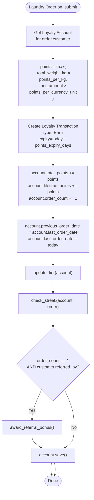
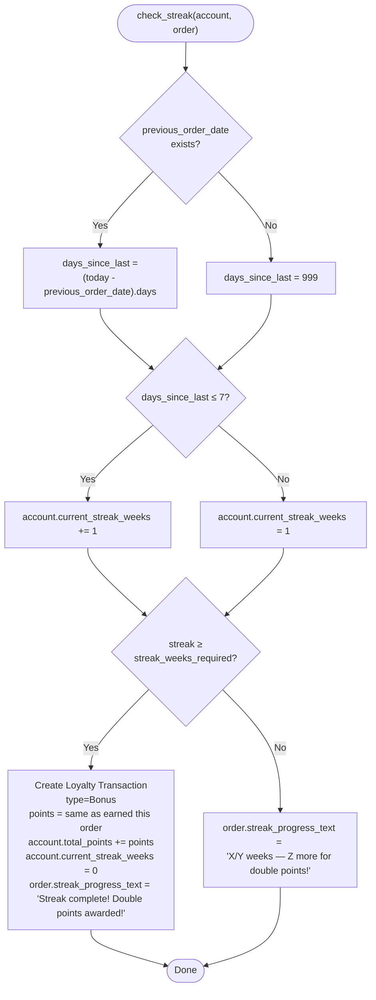
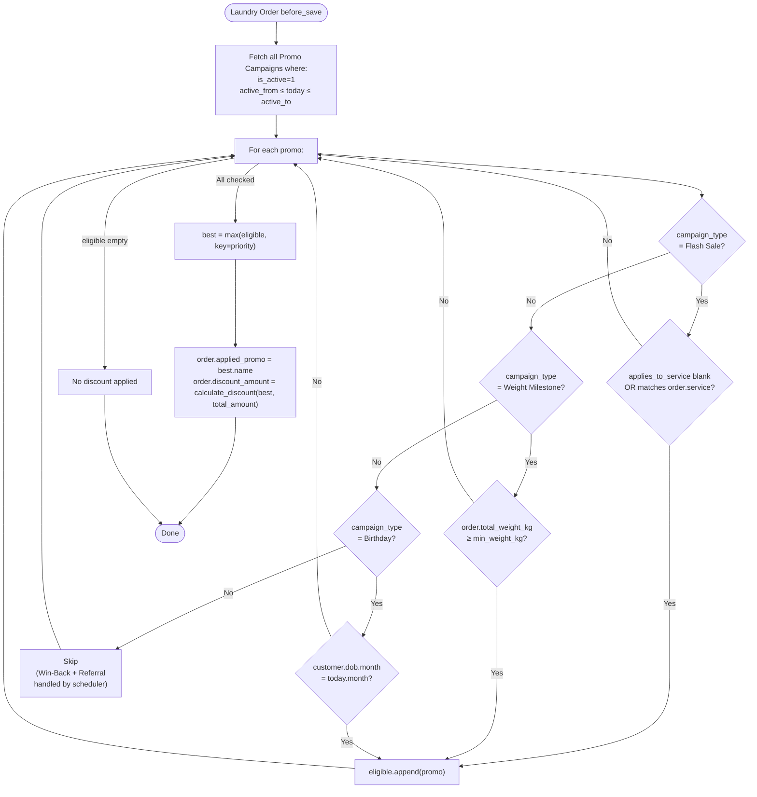
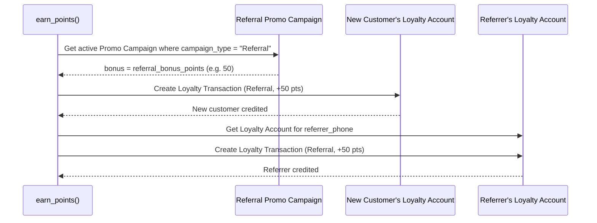

# Business Logic — Loyalty & Gamification

**File:** `spinly/logic/loyalty.py`

---

## earn_points() — Full Flow

**Triggered:** `Laundry Order → on_submit`



---

## update_tier()

```python
def update_tier(account):
    settings = frappe.get_single("Spinly Settings")
    if account.lifetime_points >= settings.tier_gold_pts:
        account.tier = "Gold"
    elif account.lifetime_points >= settings.tier_silver_pts:
        account.tier = "Silver"
    else:
        account.tier = "Bronze"
```

| Threshold | Tier | Benefits |
|---|---|---|
| 0 – 499 lifetime pts | Bronze | Standard pricing |
| 500 – 1999 lifetime pts | Silver | Priority queue, 5% discount |
| 2000+ lifetime pts | Gold | Free pickup bag, 10% discount, dedicated WhatsApp |

> Tier is based on **lifetime_points** — customers never lose tier by spending redeemable points.

---

## check_streak()



> `previous_order_date` is captured **before** `last_order_date` is overwritten. This prevents self-comparison on the same day.

---

## apply_best_discount() — Promo Engine

**Triggered:** `Laundry Order → before_save`



**Campaign types handled at order level:**
- ✅ Flash Sale
- ✅ Weight Milestone
- ✅ Birthday

**Campaign types handled by background scheduler (NOT order-level):**
- ⚙️ Win-Back — daily job
- ⚙️ Referral — earn_points() first-order check

---

## award_referral_bonus()

**Triggered:** Inside `earn_points()` when `order_count == 1` AND `customer.referred_by` is set.



- Only fires on the **first order** (order_count == 1)
- Requires an active Promo Campaign of type `Referral` to be configured
- Both accounts credited simultaneously

---

## issue_scratch_card()

**Triggered:** `Laundry Job Card → on_update` when `workflow_state → Ready`

```python
def issue_scratch_card(doc, method):
    if doc.workflow_state != "Ready":
        return
    order = frappe.get_doc("Laundry Order", doc.order)
    account = frappe.get_doc("Loyalty Account", {"customer": order.customer})
    settings = frappe.get_single("Spinly Settings")

    if account.order_count % settings.scratch_card_frequency == 0:
        prize = assign_random_prize()  # internal logic
        card = frappe.new_doc("Scratch Card")
        card.customer = order.customer
        card.order = order.name
        card.prize_type = prize.type
        card.prize_value = prize.value
        card.status = "Pending"
        card.insert()
        whatsapp_handler.send_message(
            customer=order.customer,
            message_type="Scratch Card",
            context={"scratch_card_link": get_scratch_card_url(card.name)}
        )
        card.issued_via_whatsapp = 1
        card.save()
```

> `order_count` is already incremented by `earn_points()` (fired on Order submit). By the time the Job Card reaches `Ready`, the count is always current.

---

## Scheduler Jobs

### expire_old_points() — Daily

```python
def expire_old_points():
    # Find Earn transactions past their expiry that haven't been expired yet
    expired_txns = frappe.get_all(
        "Loyalty Transaction",
        filters={"transaction_type": "Earn", "expiry_date": ["<", today]},
        fields=["name", "loyalty_account", "points"]
    )
    for txn in expired_txns:
        account = frappe.get_doc("Loyalty Account", txn.loyalty_account)
        # Create Expire transaction
        frappe.get_doc({
            "doctype": "Loyalty Transaction",
            "loyalty_account": txn.loyalty_account,
            "transaction_type": "Expire",
            "points": -txn.points,
            "description": f"Expired points from {txn.name}"
        }).insert()
        account.total_points = max(0, account.total_points - txn.points)
        account.save()
```

### evaluate_streaks() — Weekly
Re-evaluates streak status for all active customers (catch-all for edge cases).

### recalculate_all_tiers() — Monthly
Recalculates tier for all customers from `lifetime_points`. Guards against any drift from real-time tier updates.

---

## create_loyalty_account() — After Customer Insert

**Triggered:** `Laundry Customer → after_insert`

```python
def create_loyalty_account(doc, method):
    # Guard against duplicates
    if frappe.db.exists("Loyalty Account", {"customer": doc.name}):
        return
    frappe.get_doc({
        "doctype": "Loyalty Account",
        "customer": doc.name,
        "total_points": 0,
        "lifetime_points": 0,
        "tier": "Bronze",
        "order_count": 0,
        "current_streak_weeks": 0
    }).insert(ignore_permissions=True)
```

---

## Anti-Patterns

- ❌ Never apply two promos simultaneously — priority stack allows only one
- ❌ Never create a credit note or GL entry for a discount — `discount_amount` field on order only
- ❌ Never let `lifetime_points` decrement — it is append-only for tier accuracy
- ❌ Never check streak using `last_order_date` directly — always use `previous_order_date` (which was captured before the overwrite)
- ❌ Never create a separate customer app for loyalty — WhatsApp is the loyalty channel

---

## Related
- [[02 - Loyalty & Gamification/_Index]]
- [[02 - Loyalty & Gamification/Data Model]]
- [[04 - Notifications/Business Logic]]
- [[🔗 Hook Map]]
- [[06 - System/Background Jobs]]
