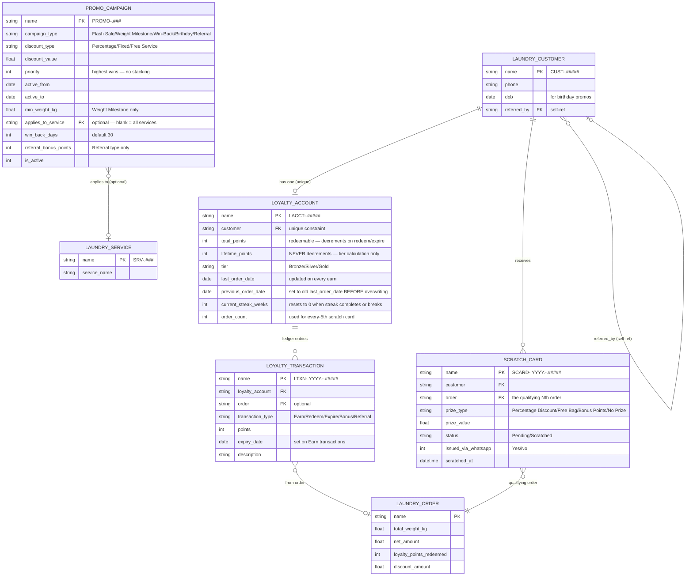

# Data Model — Loyalty & Gamification

Four DocTypes form the loyalty system. Two are transactional ledger records (Loyalty Account + Transaction), two are gamification tools (Promo Campaign + Scratch Card).

---

## ER Diagram

---

## Loyalty Account — Field Reference

| Field | Type | Description |
|---|---|---|
| `name` | Data | Auto: `LACCT-.#####` |
| `customer` | Link → Laundry Customer | **Unique constraint** — guard via `frappe.db.exists()` before insert |
| `total_points` | Int | Current redeemable balance. **Decrements** on Redeem and Expire events. |
| `lifetime_points` | Int | Cumulative all-time earned points. **Never decrements.** Used exclusively for tier calculation. |
| `tier` | Select | `Bronze` / `Silver` / `Gold` — auto-updated on every earn |
| `last_order_date` | Date | Date of most recent order — **overwritten** on each earn |
| `previous_order_date` | Date | Set to old `last_order_date` **before** it is overwritten — used by `check_streak()` to avoid self-comparison |
| `current_streak_weeks` | Int | Consecutive weeks with ≥1 order. Resets to 0 on streak completion or gap. |
| `order_count` | Int | Total submitted orders. Used for `order_count % scratch_card_frequency` check. |

> **Critical distinction:** `total_points` can go down. `lifetime_points` only ever goes up. Tier is based on `lifetime_points` — customers cannot lose their tier by spending points.

---

## Loyalty Transaction — Field Reference

| Field | Type | Description |
|---|---|---|
| `name` | Data | Auto: `LTXN-.YYYY.-.#####` |
| `loyalty_account` | Link → Loyalty Account | The ledger this transaction belongs to |
| `order` | Link → Laundry Order | Optional — absent for Expire transactions |
| `transaction_type` | Select | `Earn` / `Redeem` / `Expire` / `Bonus` / `Referral` |
| `points` | Int | Positive for Earn/Bonus/Referral, negative for Redeem/Expire |
| `expiry_date` | Date | Set on Earn transactions (today + `points_expiry_days`). Null on others. |
| `description` | Small Text | Human-readable: "Earned 45 pts on ORD-2026-00012" |

---

## Promo Campaign — Field Reference

| Field | Type | Description |
|---|---|---|
| `name` | Data | Auto: `PROMO-.###` |
| `campaign_type` | Select | `Flash Sale` / `Weight Milestone` / `Win-Back` / `Birthday` / `Referral` |
| `discount_type` | Select | `Percentage` / `Fixed` / `Free Service` |
| `discount_value` | Float | % or ₹ amount depending on discount_type |
| `priority` | Int | Higher number = applied first when multiple campaigns eligible |
| `active_from` | Date | Campaign start date |
| `active_to` | Date | Campaign end date |
| `min_weight_kg` | Float | Weight Milestone only — minimum order weight |
| `applies_to_service` | Link → Laundry Service | Flash Sale only — blank = applies to all services |
| `win_back_days` | Int | Win-Back only — default 30 |
| `referral_bonus_points` | Int | Referral only — points credited to both referrer + referee |
| `is_active` | Check | Master on/off switch |

> **Priority Stack Rule:** Only the single highest-priority eligible campaign applies per order. No combining discounts. This keeps margin predictable.

---

## Scratch Card — Field Reference

| Field | Type | Description |
|---|---|---|
| `name` | Data | Auto: `SCARD-.YYYY.-.#####` |
| `customer` | Link → Laundry Customer | Who receives the scratch card |
| `order` | Link → Laundry Order | The qualifying order (the Nth order that triggered issuance) |
| `prize_type` | Select | `Percentage Discount` / `Free Bag` / `Bonus Points` / `No Prize` |
| `prize_value` | Float | % off or bonus points value |
| `status` | Select | `Pending` (issued, not yet scratched) / `Scratched` |
| `issued_via_whatsapp` | Check | Whether WhatsApp link was sent |
| `scratched_at` | Datetime | Timestamp when customer scratched |

---

## Related
- [[02 - Loyalty & Gamification/_Index]]
- [[02 - Loyalty & Gamification/Business Logic]]
- [[01 - Order Flow/Data Model]]
- [[📊 DocType Map]]
