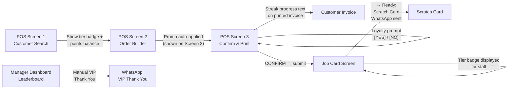

# UI — Loyalty & Gamification

Loyalty touches three surfaces: the POS Screen 3 (loyalty prompt + promo display), the Job Card screen (tier badge), and the Manager Dashboard (leaderboard + VIP trigger).

---

## Loyalty UI Touchpoints



---

## POS Screen 1 — Loyalty Display

When a returning customer is found by phone:
- **Tier badge** shown prominently: 🥉 Bronze / 🥈 Silver / 🥇 Gold
- **Points balance** shown: "You have 320 pts (₹32 redeemable)"
- **Priority indicator** for Silver/Gold: highlighted card border + "Priority Customer" label
- Staff can see tier before any order is built — sets expectations

---

## POS Screen 3 — Loyalty Prompt

Shown **only if** `account.total_points > 0` and `enable_loyalty_program = Yes`:

```
┌─────────────────────────────────────────────┐
│  💰 Apply 150 pts for ₹15 off?               │
│                                              │
│   [ YES — Apply Discount ]  [ NO, Skip ]    │
└─────────────────────────────────────────────┘
```

- **1 tap** to apply or skip
- If [YES]: `loyalty_points_redeemed` set on order, `discount_amount` updated
- Promo discount (if any) is shown as a separate non-interactive banner above the loyalty prompt
- No stacking: if a promo is already active, the loyalty prompt is still shown — staff decides

---

## POS Screen 3 — Promo Display

When `applied_promo` is set by the promo engine:
```
┌─────────────────────────────────────────────┐
│  🎉 Flash Sale: 20% off Dry Clean applied    │
└─────────────────────────────────────────────┘
```
- Read-only banner (auto-applied, no staff action needed)
- Shows `campaign_type` + discount description

---

## Job Card Screen — Tier Badge

The `customer_tier_badge` field is displayed prominently:

| Badge | Display | Staff Action |
|---|---|---|
| 🥉 Bronze | Grey badge | Standard handling |
| 🥈 Silver | Silver badge | Priority handling, queue bump |
| 🥇 Gold | Gold badge + glow | Highest priority, notify manager |

Staff see this badge without needing to look up the customer — enables consistent VIP treatment without extra taps.

---

## Customer Invoice — Streak Progress Text

The `streak_progress_text` field is printed on the A4 invoice:

**In progress:**
> "3/4 weeks — 1 more for double points!"

**Completed:**
> "Streak complete! Double points awarded! 🎉"

This gives the customer a reason to return next week without needing a separate communication channel.

---

## Manager Dashboard — Leaderboard

Located in the Spinly Dashboard workspace:
- **Top 10 customers by monthly spend** (descending order)
- Shows: rank, customer name, monthly spend, tier badge
- **[Send VIP Thank You]** button next to top 3 customers
  - Triggers `whatsapp_handler.send_message(message_type="VIP Thank You")`
  - Creates WhatsApp Message Log entry (status=Queued)
  - 1 tap per customer — no template editing needed

---

## Related
- [[02 - Loyalty & Gamification/_Index]]
- [[01 - Order Flow/UI]]
- [[04 - Notifications/UI]]
- [[05 - Configuration & Masters/UI]]
- [[06 - System/Print Formats]]
