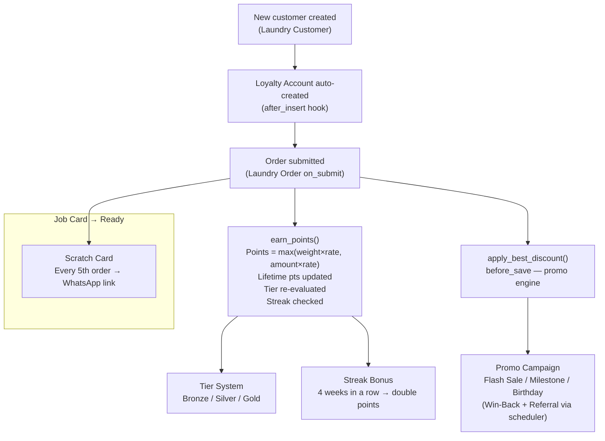

# 02 - Loyalty & Gamification

The Loyalty & Gamification module drives repeat visits through a points engine, tier system, streak bonuses, promo campaigns, and scratch cards — all without touching accounting. Discounts are stored as a single `discount_amount` field on the order.

Enable/disable the entire module via `Spinly Settings.enable_loyalty_program`.

---

## Loyalty Lifecycle

---

## Documents in this Module

| Document | Description |
|---|---|
| [[02 - Loyalty & Gamification/Data Model]] | Loyalty Account, Transaction, Promo Campaign, Scratch Card fields |
| [[02 - Loyalty & Gamification/Business Logic]] | Points engine, tier updates, streaks, promos, referrals, scratch cards |
| [[02 - Loyalty & Gamification/UI]] | POS loyalty prompt, tier badge, streak text, leaderboard |
| [[02 - Loyalty & Gamification/Testing]] | All loyalty and gamification test scenarios |

---

## Key DocTypes

| DocType | Naming | Role |
|---|---|---|
| Loyalty Account | `LACCT-.#####` | Running balance ledger head (1-to-1 with customer) |
| Loyalty Transaction | `LTXN-.YYYY.-.#####` | Individual earn/redeem/expire/bonus/referral events |
| Promo Campaign | `PROMO-.###` | Discount rule (no-stack, priority-based) |
| Scratch Card | `SCARD-.YYYY.-.#####` | Gamification reward issued every 5th order |

---

## Settings That Control This Module

| Setting | Controls |
|---|---|
| `enable_loyalty_program` | Gates entire module (Yes/No) |
| `points_per_kg` | Earn rate by weight |
| `points_per_currency_unit` | Earn rate by amount (max of both used) |
| `points_expiry_days` | Default: 90 days |
| `redemption_rate` | 100 pts = ₹10 |
| `scratch_card_frequency` | Every N orders (default 5) |
| `streak_weeks_required` | Weeks for double points bonus (default 4) |
| `tier_silver_pts` / `tier_gold_pts` | Tier thresholds (500 / 2000 lifetime pts) |
| `tier_silver_discount_pct` / `tier_gold_discount_pct` | Tier discounts (5% / 10%) |

---

## Tier Summary

| Tier | Lifetime Points | Benefit |
|---|---|---|
| 🥉 Bronze | 0 – 499 | Standard pricing |
| 🥈 Silver | 500 – 1999 | Priority queue (lower ETA), 5% discount |
| 🥇 Gold | 2000+ | Free pickup bag, 10% discount, dedicated WhatsApp line |

---

## Related
- [[🏠 Spinly — Master Index]]
- [[🔗 Hook Map]]
- [[01 - Order Flow/_Index]]
- [[04 - Notifications/_Index]]
- [[05 - Configuration & Masters/Data Model]]
