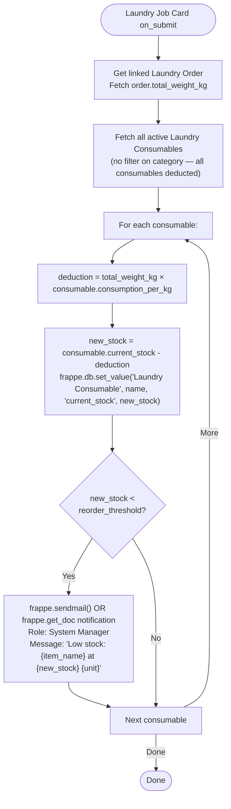
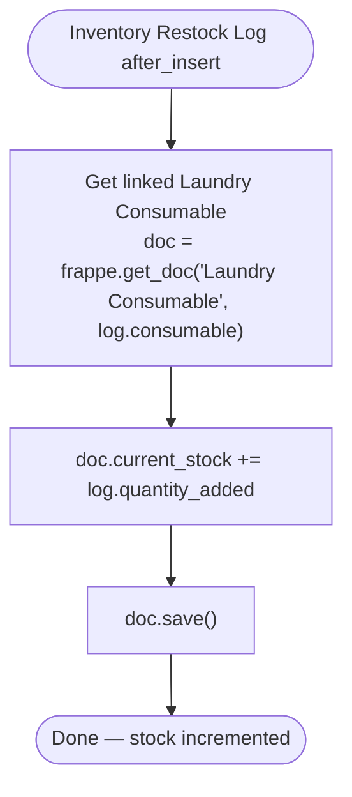

# Business Logic — Inventory

**File:** `spinly/logic/inventory.py`

---

## deduct_consumables() — Full Flow

**Triggered:** `Laundry Job Card → on_submit`



---

## Deduction Formula

```
deduction = order.total_weight_kg × consumable.consumption_per_kg
new_stock = consumable.current_stock - deduction
```

**Example:**
- Order weight: 5 kg
- Detergent Pro consumption_per_kg: 30 ml/kg
- Deduction: 5 × 30 = **150 ml**
- If current_stock was 4500 ml → new_stock = **4350 ml**

> Deduction is **weight-based**, not garment-type-based. Every kg of laundry deducts the same amount regardless of garment type (shirts, sarees, bedding — all treated equally).

---

## Why frappe.db.set_value (not doc.save)

`frappe.db.set_value` writes directly to the database without triggering hooks. This is intentional:
- **Performance:** Avoids re-triggering on_update hooks for each consumable during batch processing
- **Safety:** Prevents recursive hook chains
- **Accuracy:** `current_stock` is a simple numeric field — no business logic on update needed

---

## Low-Stock Alert

When `new_stock < reorder_threshold` after deduction:
- Frappe notification created for **System Manager** role
- Notification includes: item_name, new_stock, unit, reorder_threshold, reorder_quantity (suggested)
- Alert appears on Manager Dashboard as a red highlight row

---

## apply_restock() — Full Flow

**Triggered:** `Inventory Restock Log → after_insert`



```python
def apply_restock(doc, method):
    consumable = frappe.get_doc("Laundry Consumable", doc.consumable)
    consumable.current_stock += doc.quantity_added
    consumable.save()
```

> The manager never needs to manually update `current_stock`. Creating a Restock Log entry is the only required action.

---

## Anti-Patterns

- ❌ Never deduct stock on Order submit — only on **Job Card submit** (when work actually starts)
- ❌ Never manually edit `current_stock` — always use Inventory Restock Log for additions
- ❌ Never allow `current_stock` to go negative — add validation if needed
- ❌ Never deduct based on garment type — deduction is always weight × consumption_per_kg

---

## Related
- [[03 - Inventory/_Index]]
- [[03 - Inventory/Data Model]]
- [[01 - Order Flow/Business Logic — Job Card Lifecycle]]
- [[🔗 Hook Map]]
