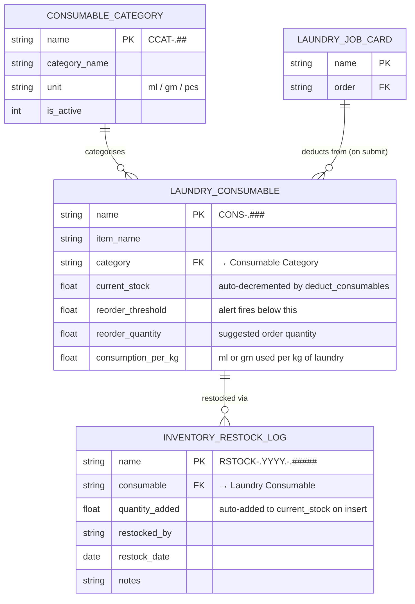

# Data Model — Inventory

Three DocTypes manage consumable inventory: the category master, the stock master with consumption rate, and the restock log.

---

## ER Diagram

---

## Consumable Category — Field Reference

| Field | Type | Description |
|---|---|---|
| `name` | Data | Auto: `CCAT-.##` |
| `category_name` | Data | e.g. Detergent, Softener |
| `unit` | Select | `ml` / `gm` / `pcs` — governs how stock is measured |
| `is_active` | Check | Inactive categories excluded from deduction |

**Seed data:** Detergent, Softener, Stain Remover, Fabric Conditioner

---

## Laundry Consumable — Field Reference

| Field | Type | Description |
|---|---|---|
| `name` | Data | Auto: `CONS-.###` |
| `item_name` | Data | e.g. "Detergent Pro" |
| `category` | Link → Consumable Category | Groups the item |
| `current_stock` | Float | Current quantity in stock (in the unit defined by category) |
| `reorder_threshold` | Float | Alert fires when `current_stock < reorder_threshold` |
| `reorder_quantity` | Float | Suggested quantity for next restock (informational) |
| `consumption_per_kg` | Float | How much is consumed per kg of laundry processed |

> **consumption_per_kg** is the core field. Deduction is weight-based, not garment-type-based. A 5 kg order always deducts the same amount regardless of whether it's shirts or bedding.

---

## Inventory Restock Log — Field Reference

| Field | Type | Description |
|---|---|---|
| `name` | Data | Auto: `RSTOCK-.YYYY.-.#####` |
| `consumable` | Link → Laundry Consumable | Which item was restocked |
| `quantity_added` | Float | Amount added to stock |
| `restocked_by` | Data | Who performed the restock |
| `restock_date` | Date | When restocked |
| `notes` | Small Text | Optional notes |

> **on `after_insert`:** `inventory.apply_restock()` fires automatically — `current_stock += quantity_added` on the linked Laundry Consumable. No manual update needed.

---

## Seed Consumable Data

| Item | Category | Stock | Threshold | Reorder Qty | Consumption/kg |
|---|---|---|---|---|---|
| Detergent Pro | Detergent | 4500 ml | 500 ml | 2000 ml | 30 ml/kg |
| Fabric Softener | Softener | 380 ml | 400 ml ⚠️ | 1000 ml | 10 ml/kg |
| Stain Remover | Stain Remover | 1200 ml | 200 ml | 500 ml | 5 ml/kg |
| Whitener | Detergent | 150 ml | 200 ml ⚠️ | 500 ml | 8 ml/kg |
| Conditioner Plus | Fabric Conditioner | 2000 ml | 300 ml | 1000 ml | 12 ml/kg |
| Dry Clean Solvent | Stain Remover | 800 ml | 1000 ml ⚠️ | 2000 ml | 50 ml/kg |

⚠️ = below threshold at seed time (used for testing low-stock alerts on dashboard)

---

## Related
- [[03 - Inventory/_Index]]
- [[03 - Inventory/Business Logic]]
- [[05 - Configuration & Masters/Data Model]]
- [[📊 DocType Map]]
