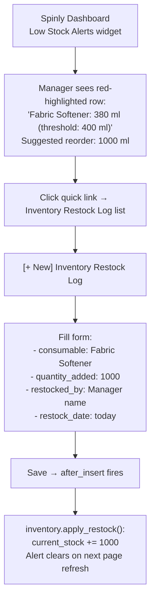

# UI — Inventory

Inventory management requires zero terminal access. The manager views low-stock alerts on the Spinly Dashboard and creates restock logs via the standard Frappe form.

---

## Manager Restock Workflow

---

## Spinly Dashboard — Low Stock Alerts Widget

| Element | Description |
|---|---|
| Widget title | "⚠️ Low Stock Alerts" |
| Row format | `{item_name}: {current_stock} {unit} (threshold: {reorder_threshold} {unit})` |
| Row color | 🔴 Red background — unmissable |
| Sort order | Most critical first (furthest below threshold as % of threshold) |
| Suggested reorder | Shows `reorder_quantity` as a hint |
| Quick link | "Restock" button per row → opens new Inventory Restock Log pre-filled with consumable |

**Seed state:** 3 of 6 consumables are below threshold at load time — alerts are visible on first dashboard open.

---

## Inventory Restock Log Form

Standard Frappe form. Fields:
- `consumable` — Link field (searchable dropdown)
- `quantity_added` — Numeric
- `restocked_by` — Text (manager name)
- `restock_date` — Date (auto-filled today)
- `notes` — Optional text

On save: `apply_restock()` fires automatically. No additional action required.

---

## Related
- [[03 - Inventory/_Index]]
- [[03 - Inventory/Business Logic]]
- [[05 - Configuration & Masters/UI]]
