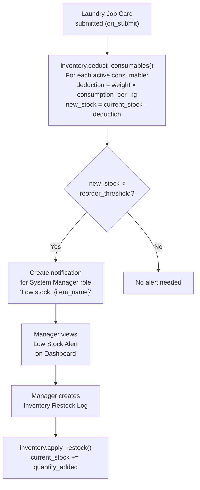

# 03 - Inventory

The Inventory module automatically deducts consumable stock when a Job Card is submitted, alerts the System Manager when stock falls below threshold, and auto-increments stock when a restock log entry is created. Zero manual stock counting required.

---

## Inventory Lifecycle

---

## Documents in this Module

| Document | Description |
|---|---|
| [[03 - Inventory/Data Model]] | Laundry Consumable, Consumable Category, Inventory Restock Log fields |
| [[03 - Inventory/Business Logic]] | Deduction formula, apply_restock, low-stock alert |
| [[03 - Inventory/UI]] | Low stock alerts on dashboard, restock log form |
| [[03 - Inventory/Testing]] | Deduction tests, restock tests, threshold alert tests |

---

## Key DocTypes

| DocType | Naming | Role |
|---|---|---|
| Laundry Consumable | `CONS-.###` | Stock master with consumption rate |
| Consumable Category | `CCAT-.##` | Category + unit (ml/gm/pcs) |
| Inventory Restock Log | `RSTOCK-.YYYY.-.#####` | Restock entry — triggers auto-increment |

---

## Related
- [[🏠 Spinly — Master Index]]
- [[01 - Order Flow/Business Logic — Job Card Lifecycle]]
- [[🔗 Hook Map]]
- [[05 - Configuration & Masters/_Index]]
