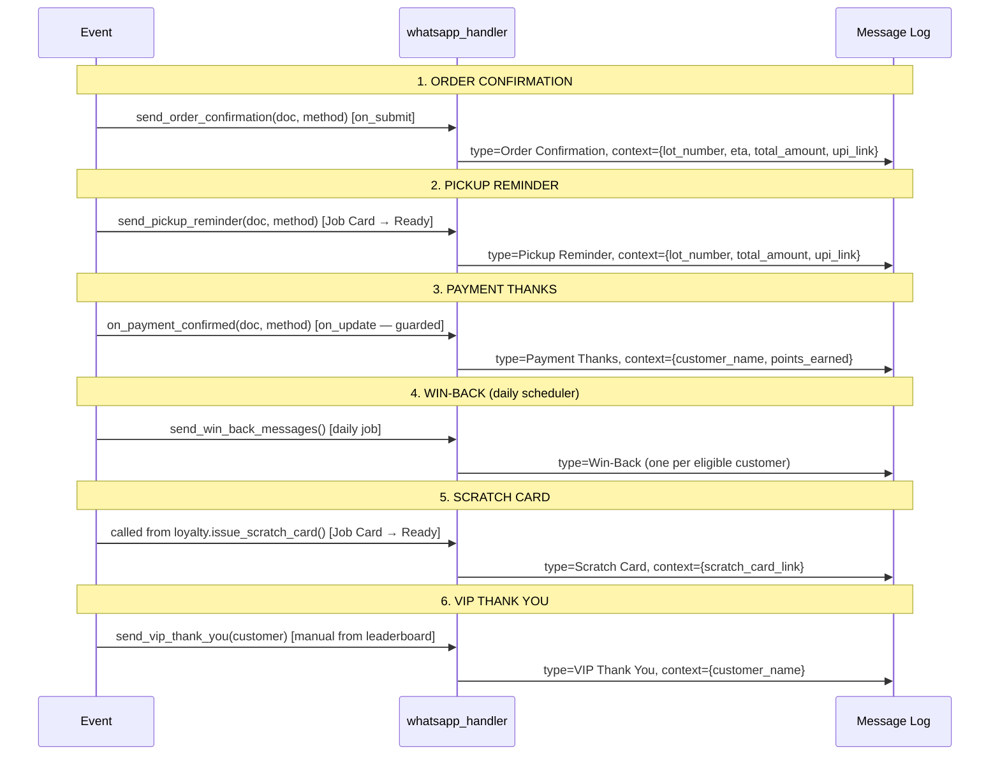

# Business Logic — Notifications

**File:** `spinly/integrations/whatsapp_handler.py`

---

## send_message() — Core Architecture

```python
def send_message(customer, message_type, context):
    # 1. Select template by type + customer language
    template = get_template(message_type, customer.language_preference)

    # 2. Render placeholders
    message = render_template(template.template_body, context)

    # 3. Route by provider
    provider = frappe.db.get_single_value("Spinly Settings", "whatsapp_provider")
    if provider == "Stub":
        log_message(customer, message_type, template, "Queued")   # Phase 1
    else:
        send_via_provider(provider, customer.phone, message)       # Phase 2
        log_message(customer, message_type, template, "Sent")
```

**Phase 1 → Phase 2 migration:** Change `whatsapp_provider` in Spinly Settings from "Stub" to "Twilio" (or Interakt/Wati) and set `whatsapp_api_key` + `whatsapp_api_url`. Zero code changes.

---

## 6 Trigger Flows



---

## Trigger Details

| # | Message Type | Trigger Function | Context Variables |
|---|---|---|---|
| 1 | Order Confirmation | `send_order_confirmation(doc, method)` | `lot_number`, `eta`, `total_amount`, `upi_link` |
| 2 | Pickup Reminder | `send_pickup_reminder(doc, method)` | `lot_number`, `total_amount`, `upi_link` |
| 3 | Payment Thanks | `on_payment_confirmed(doc, method)` (guarded) | `customer_name`, `points_earned` |
| 4 | Win-Back | `send_win_back_messages()` (daily scheduler) | `discount_from_win_back_promo` |
| 5 | Scratch Card | Called from `loyalty.issue_scratch_card()` | `scratch_card_link` |
| 6 | VIP Thank You | `send_vip_thank_you(customer)` (manual) | `customer_name` |

---

## Payment Transition Guard

`on_payment_confirmed` is wired to `Laundry Order → on_update`. Because `on_update` fires on every save (not just payment changes), a guard is required:

```python
def on_payment_confirmed(doc, method):
    doc_before = doc.get_doc_before_save()
    if doc.payment_status == "Paid" and doc_before.payment_status != "Paid":
        send_message(
            customer=frappe.get_doc("Laundry Customer", doc.customer),
            message_type="Payment Thanks",
            context={
                "customer_name": doc.customer_name,
                "points_earned": get_points_earned(doc)
            }
        )
```

This ensures the Payment Thanks WhatsApp fires **exactly once** — on the `Unpaid → Paid` transition — not on every subsequent save.

---

## Win-Back Daily Scheduler

```python
def send_win_back_messages():
    settings = frappe.get_single("Spinly Settings")
    win_back_days = get_active_win_back_campaign_days() or 30

    cutoff_date = frappe.utils.add_days(frappe.utils.today(), -win_back_days)
    inactive_customers = frappe.get_all(
        "Loyalty Account",
        filters={"last_order_date": ["<", cutoff_date]},
        fields=["customer"]
    )
    for row in inactive_customers:
        customer = frappe.get_doc("Laundry Customer", row.customer)
        send_message(
            customer=customer,
            message_type="Win-Back",
            context={"discount_from_win_back_promo": get_win_back_discount()}
        )
```

---

## Multilingual Template Selection

```python
def get_template(message_type, language_preference):
    # Try customer's preferred language first
    template = frappe.get_value(
        "WhatsApp Message Template",
        {"message_type": message_type, "language": language_preference, "is_active": 1},
        "name"
    )
    if not template:
        # Fall back to default_language from Spinly Settings
        default_lang = frappe.db.get_single_value("Spinly Settings", "default_language")
        template = frappe.get_value(
            "WhatsApp Message Template",
            {"message_type": message_type, "language": default_lang, "is_active": 1},
            "name"
        )
    return frappe.get_doc("WhatsApp Message Template", template)
```

- Customer language → template in that language
- No matching template → fall back to `Spinly Settings.default_language`
- Enables adding new languages without code changes (just create template records)

---

## Anti-Patterns

- ❌ Never send WhatsApp synchronously in hooks — always queue to Message Log first
- ❌ Never hardcode message text in Python — always use WhatsApp Message Template
- ❌ Never fire Payment Thanks on every save — the Unpaid→Paid guard is mandatory
- ❌ Never create a new provider integration by editing hook functions — change `whatsapp_provider` in Settings only

---

## Related
- [[04 - Notifications/_Index]]
- [[04 - Notifications/Data Model]]
- [[02 - Loyalty & Gamification/Business Logic]]
- [[🔗 Hook Map]]
- [[06 - System/Background Jobs]]
