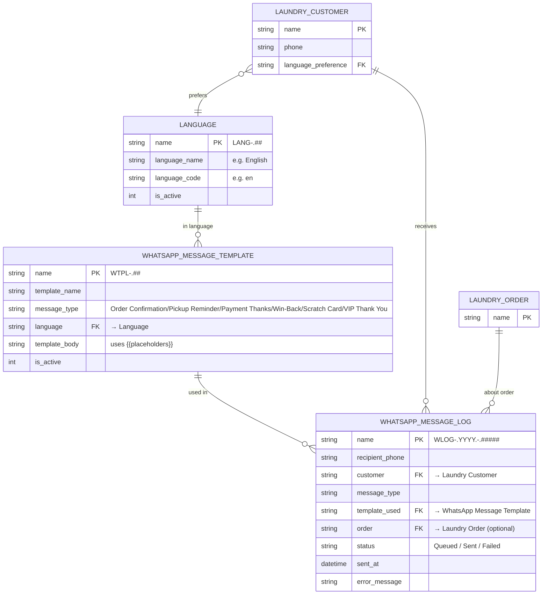

# Data Model — Notifications

Three DocTypes manage WhatsApp notifications: the Language master, the message template library, and the message log.

---

## ER Diagram

---

## Language — Field Reference

| Field | Type | Description |
|---|---|---|
| `name` | Data | Auto: `LANG-.##` |
| `language_name` | Data | e.g. "English", "Hindi", "Marathi" |
| `language_code` | Data | e.g. "en", "hi", "mr" |
| `is_active` | Check | Inactive languages hidden from template selection |

**Seed data:** English (en), Hindi (hi), Marathi (mr)

---

## WhatsApp Message Template — Field Reference

| Field | Type | Description |
|---|---|---|
| `name` | Data | Auto: `WTPL-.##` |
| `template_name` | Data | Human-readable identifier |
| `message_type` | Select | One of 6 message types (see below) |
| `language` | Link → Language | Which language this template is in |
| `template_body` | Long Text | Message body with `{{placeholder}}` variables |
| `is_active` | Check | Inactive templates not used |

**Message Types:**
| Value | Trigger |
|---|---|
| `Order Confirmation` | Order submit |
| `Pickup Reminder` | Job Card → Ready |
| `Payment Thanks` | Payment Unpaid→Paid |
| `Win-Back` | Daily scheduler |
| `Scratch Card` | Job Card → Ready (5th order) |
| `VIP Thank You` | Manual from leaderboard |

**Available Placeholders:**
| Placeholder | Source |
|---|---|
| `{{customer_name}}` | `Laundry Customer.full_name` |
| `{{eta}}` | `Laundry Order.eta` (formatted) |
| `{{total_amount}}` | `Laundry Order.net_amount` |
| `{{upi_link}}` | Generated from `Spinly Settings.upi_id` |
| `{{lot_number}}` | `Laundry Order.lot_number` |
| `{{points_balance}}` | `Loyalty Account.total_points` |
| `{{discount_applied}}` | `Laundry Order.discount_amount` |
| `{{streak_progress}}` | `Laundry Order.streak_progress_text` |

**Total templates:** 6 types × 3 languages = **18 templates**

---

## WhatsApp Message Log — Field Reference

| Field | Type | Description |
|---|---|---|
| `name` | Data | Auto: `WLOG-.YYYY.-.#####` |
| `recipient_phone` | Data | Customer phone number |
| `customer` | Link → Laundry Customer | Sender identity |
| `message_type` | Data | Which of the 6 types was sent |
| `template_used` | Link → WhatsApp Message Template | Which template was rendered |
| `order` | Link → Laundry Order | Optional — blank for Win-Back and VIP messages |
| `status` | Select | `Queued` (Phase 1 stub) / `Sent` / `Failed` |
| `sent_at` | Datetime | Timestamp of send attempt |
| `error_message` | Small Text | Provider error if status = Failed |

> In Phase 1, all log entries are `Queued`. The log is the proof-of-delivery record for Phase 2 auditing.

---

## Related
- [[04 - Notifications/_Index]]
- [[04 - Notifications/Business Logic]]
- [[05 - Configuration & Masters/Data Model]]
- [[📊 DocType Map]]
