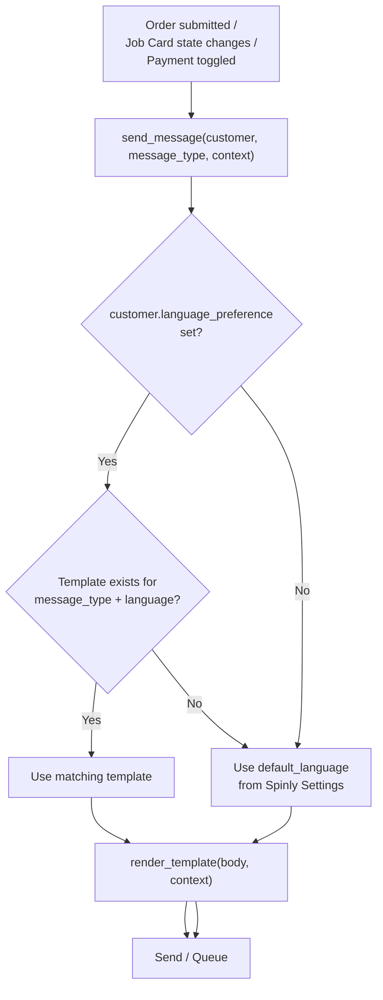

# UI — Notifications

WhatsApp-related UI surfaces appear in two places: the Manager Dashboard (message log + VIP trigger) and Spinly Settings (provider + language config).

---

## Multilingual Template Selection Path



---

## Manager Dashboard — WhatsApp Message Log Widget

| Element | Description |
|---|---|
| Widget title | "📱 Recent WhatsApp Messages" |
| Columns | Customer, Phone, Message Type, Status, Sent At |
| Status colours | 🟡 Queued (Phase 1), 🟢 Sent, 🔴 Failed |
| Quick link | "View All" → opens full WhatsApp Message Log list |
| Filter | Default: last 24 hours. Manager can adjust. |

---

## Manager Dashboard — VIP Thank You Trigger

Located in the **Top 10 Leaderboard** widget:

```
┌─────────────────────────────────────────────────────┐
│  🏆 Top Customers This Month                         │
│  1.  Priya Sharma     ₹4,200   🥇  [Send VIP 💌]    │
│  2.  Rahul Mehta      ₹3,800   🥇  [Send VIP 💌]    │
│  3.  Sunita Patel     ₹3,100   🥈  [Send VIP 💌]    │
│  4.  ...                                             │
└─────────────────────────────────────────────────────┘
```

- **[Send VIP 💌]** button appears next to top 3 only
- 1 tap → calls `whatsapp_handler.send_vip_thank_you(customer)`
- Creates WhatsApp Message Log entry (status=Queued in Phase 1)
- Button greys out after sending (prevents duplicate sends in same session)

---

## Spinly Settings — WhatsApp Configuration

| Field | Description |
|---|---|
| `whatsapp_provider` | Stub / Twilio / Interakt / Wati |
| `whatsapp_api_key` | API key for real provider (blank in Phase 1) |
| `whatsapp_api_url` | Provider endpoint URL (blank in Phase 1) |
| `default_language` | Fallback language for templates |

**Phase 1:** Set `whatsapp_provider = Stub`. All messages queued to DB.
**Phase 2:** Set provider + credentials. Zero code changes.

---

## Customer Language Preference

Set on `Laundry Customer` record:
- `language_preference` Link → Language
- Defaults to `Spinly Settings.default_language` if not set
- Staff can update during new customer registration (POS Screen 1 new customer flow)

---

## Adding a New Language

1. Create a new Language record (e.g. Tamil, `ta`)
2. Create 6 WhatsApp Message Template records (one per message type) in Tamil
3. Set `language_preference` on Tamil-speaking customers
4. Done — no code changes

---

## Related
- [[04 - Notifications/_Index]]
- [[04 - Notifications/Business Logic]]
- [[05 - Configuration & Masters/UI]]
- [[05 - Configuration & Masters/Data Model]]
