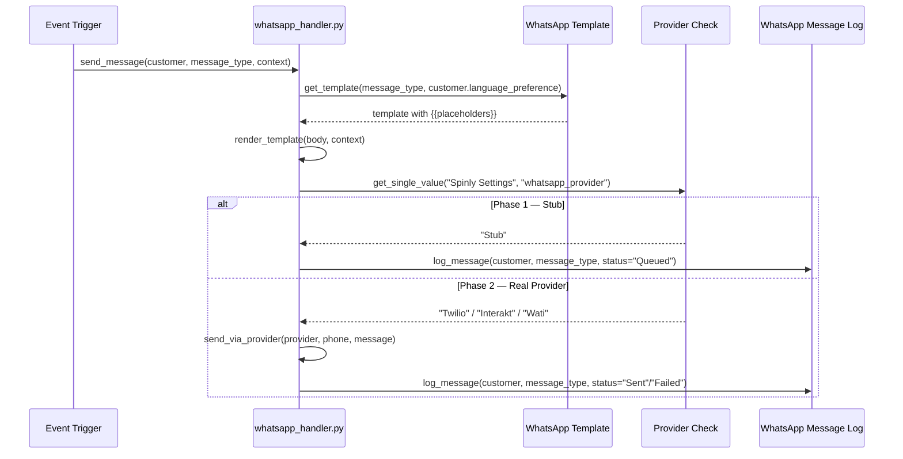

# 04 - Notifications

The Notifications module handles all WhatsApp messaging through a provider-agnostic architecture. In Phase 1, all messages are logged to the database as `Queued` (stub mode). In Phase 2, swapping 3 lines in `whatsapp_handler.py` connects to a real provider (Twilio, Interakt, or Wati).

**18 message templates** are pre-loaded: 6 message types × 3 languages (English, Hindi, Marathi).

---

## Notification Flow

---

## Documents in this Module

| Document | Description |
|---|---|
| [[04 - Notifications/Data Model]] | WhatsApp Message Template, Language, WhatsApp Message Log fields |
| [[04 - Notifications/Business Logic]] | send_message architecture, 6 trigger flows, payment guard, win-back scheduler |
| [[04 - Notifications/UI]] | Message Log view, VIP trigger, language settings |
| [[04 - Notifications/Testing]] | Stub tests for all 6 message types |

---

## 6 Message Types

| # | Type | Trigger |
|---|---|---|
| 1 | Order Confirmation | Laundry Order on_submit |
| 2 | Pickup Reminder | Job Card → Ready |
| 3 | Payment Thanks | Laundry Order Unpaid→Paid |
| 4 | Win-Back | Daily scheduler (30+ days inactive) |
| 5 | Scratch Card | Job Card → Ready (every 5th order) |
| 6 | VIP Thank You | Manual trigger from leaderboard |

---

## Related
- [[🏠 Spinly — Master Index]]
- [[🔗 Hook Map]]
- [[02 - Loyalty & Gamification/_Index]]
- [[05 - Configuration & Masters/Data Model]]
- [[06 - System/Background Jobs]]
