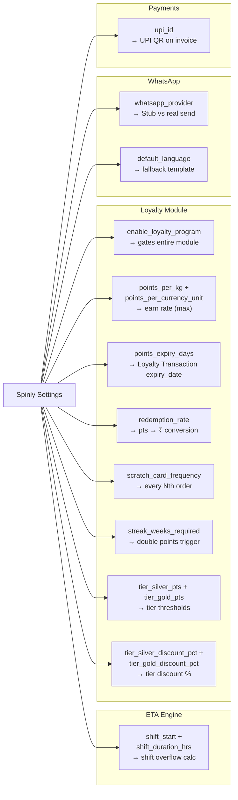

# Business Logic — Configuration & Masters

Settings and master data drive all module behavior. This document explains how each setting cascades into the system.

---

## Settings Cascade Map

---

## Setting-by-Setting Behavior

### shift_start + shift_duration_hrs
- `shift_end = shift_start + shift_duration_hrs`
- ETA engine uses `shift_end` to detect overflow
- Default: 08:00 start + 10 hrs = 18:00 end
- If ETA > 18:00 → roll to next day 08:00 + overflow

### enable_loyalty_program
- `Yes`: full loyalty module active (earn, redeem, tiers, streaks, scratch cards, promos)
- `No`: `earn_points()`, `apply_best_discount()`, `issue_scratch_card()` all short-circuit and return immediately
- Changing this live has immediate effect on all new orders

### points_per_kg + points_per_currency_unit
- Both rates evaluated on every order: `points = max(weight × per_kg, net_amount × per_currency_unit)`
- Setting both gives flexibility: high-weight low-value orders benefit from per_kg, high-value orders benefit from per_currency_unit
- If one is 0, the other always wins

### points_expiry_days
- On each Earn transaction: `expiry_date = today + points_expiry_days`
- Daily scheduler `expire_old_points()` checks `expiry_date < today`
- Default 90 days creates urgency without being punishing

### redemption_rate
- Stored as: how many pts = ₹1
- e.g. `redemption_rate = 10` means 10 pts = ₹1 (so 100 pts = ₹10)
- Used in POS Screen 3: "Apply 150 pts for ₹15 off?"

### scratch_card_frequency
- Default: 5 (every 5th order)
- Check: `account.order_count % scratch_card_frequency == 0`
- Change to 3 → every 3rd order gets a scratch card

### streak_weeks_required
- Default: 4 (4 weeks in a row)
- When `current_streak_weeks >= streak_weeks_required` → double points bonus + reset to 0

### tier_silver_pts / tier_gold_pts
- `tier_silver_pts` default: 500 lifetime pts
- `tier_gold_pts` default: 2000 lifetime pts
- Monthly `recalculate_all_tiers()` corrects any drift if these thresholds are changed post-launch

### tier discounts
- Applied as a `discount_amount` on the order (not via accounting)
- Silver: 5% → `discount_amount = total_amount × 0.05`
- Gold: 10% → `discount_amount = total_amount × 0.10`
- These stack with promo campaigns via the priority engine (highest priority wins overall)

### whatsapp_provider
- `Stub`: all messages logged as Queued, none sent
- `Twilio / Interakt / Wati`: messages sent via provider API
- Changing this from Stub to a real provider enables Phase 2 with no code changes

### upi_id
- Used in WhatsApp message templates: `{{upi_link}}`
- Used on Customer Invoice PDF for QR code generation
- Format: standard UPI ID (e.g. `spinly@upi`)

---

## Machine Status and ETA Eligibility

| Status | Eligible for allocation? | Logic |
|---|---|---|
| `Idle` | ✅ Yes | Available for new orders |
| `Running` | ✅ Yes | Eligible if capacity available |
| `Maintenance Required` | ❌ No | Filtered out in `eta_calc.calculate()` |
| `Out of Order` | ❌ No | Filtered out in `eta_calc.calculate()` |

Changing a machine status is instant — affects the very next order's ETA calculation.

---

## Anti-Patterns

- ❌ Never hardcode shift times in Python — always read from `Spinly Settings`
- ❌ Never hardcode loyalty rates — always read from `Spinly Settings`
- ❌ Never apply tier discounts as credit notes or GL entries — `discount_amount` field only
- ❌ Never set `whatsapp_provider` to a real provider without first setting `whatsapp_api_key` and `whatsapp_api_url`

---

## Related
- [[05 - Configuration & Masters/_Index]]
- [[05 - Configuration & Masters/Data Model]]
- [[01 - Order Flow/Business Logic — ETA & Machine Allocation]]
- [[02 - Loyalty & Gamification/Business Logic]]
- [[04 - Notifications/Business Logic]]
