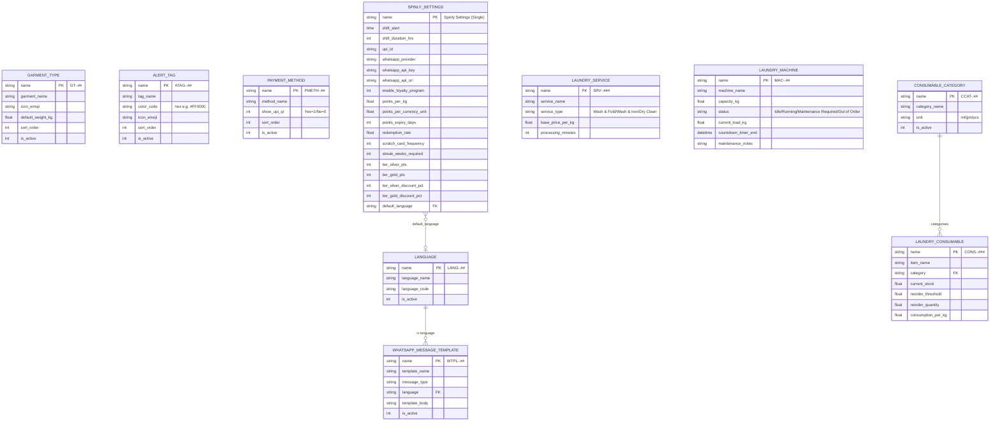
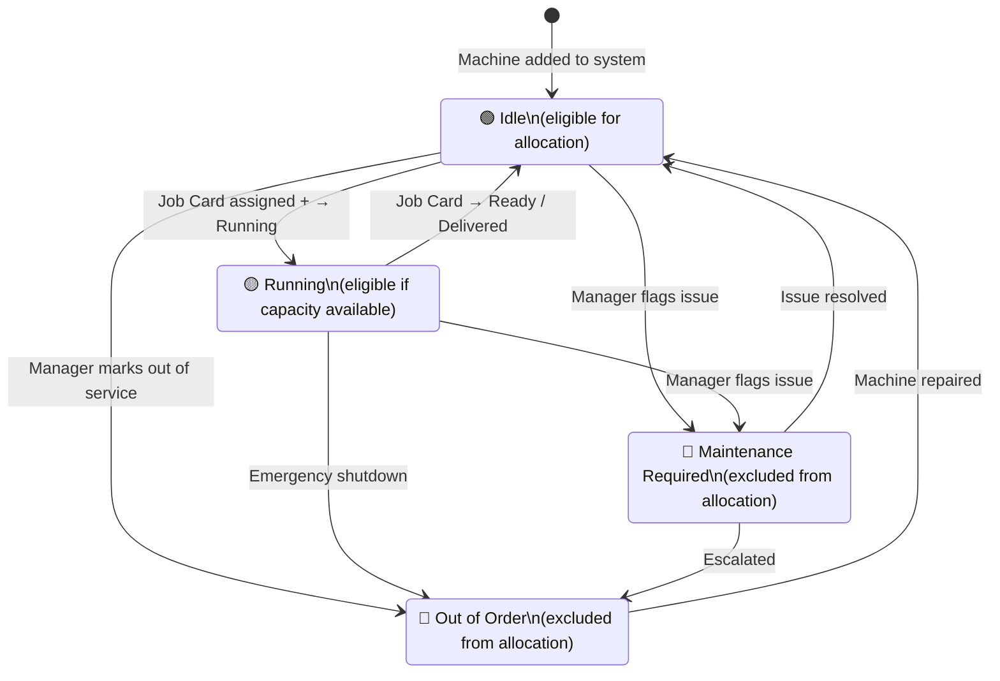

# Data Model — Configuration & Masters

All 10 configuration DocTypes with full field definitions, seed data, and relationships to transactional DocTypes.

---

## ER Diagram

---

## Garment Type — Field Reference

| Field | Description | Seed Data |
|---|---|---|
| `garment_name` | Display name | Shirt, Pants, Saree, Bedding, Jacket, Woolen |
| `icon_emoji` | Shown in POS icon grid | 👕, 👖, 👗, 🛏️, 🧥, 🧣 |
| `default_weight_kg` | Pre-fill weight when item selected | 0.2, 0.3, 0.5, 2.0, 0.8, 0.6 |
| `sort_order` | Display order in POS grid | 1–6 |
| `is_active` | Inactive = hidden from POS | All active |

---

## Alert Tag — Field Reference

| Field | Description | Seed Data |
|---|---|---|
| `tag_name` | Label shown on POS button | Whites Only, Color Bleed Risk, Delicates, Heavy Soil |
| `color_code` | Hex color of the button/badge | #FFFFFF, #EF4444, #A78BFA, #78716C |
| `icon_emoji` | Shown on badge | ⚪, 🔴, 🪶, 💪 |
| `sort_order` | Display order | 1–4 |
| `is_active` | Inactive = hidden | All active |

---

## Payment Method — Field Reference

| Field | Description | Seed Data |
|---|---|---|
| `method_name` | Name shown at checkout | Cash, UPI, Card |
| `show_upi_qr` | If Yes: UPI QR code displayed | UPI=Yes, Cash/Card=No |
| `sort_order` | Display order | 1, 2, 3 |
| `is_active` | Inactive = hidden | All active |

---

## Laundry Service — Field Reference

| Field | Description | Seed Data |
|---|---|---|
| `service_name` | Display name | Wash & Fold, Wash & Iron, Dry Clean |
| `service_type` | Category | Wash & Fold / Wash & Iron / Dry Clean |
| `base_price_per_kg` | Price used for order total | ₹40, ₹60, ₹120 |
| `processing_minutes` | Used by ETA engine (T_service) | 45, 60, 90 |

---

## Laundry Machine — Field Reference + State Diagram

| Field | Description |
|---|---|
| `machine_name` | e.g. "Washer Alpha" |
| `capacity_kg` | Maximum load in kg |
| `status` | Current status (see state diagram) |
| `current_load_kg` | Current assigned load |
| `countdown_timer_end` | When current job finishes |
| `maintenance_notes` | Free text for maintenance details |

**Machine Status State Diagram:**

**Seed Machines:**
| Machine | Capacity | Status | Test Purpose |
|---|---|---|---|
| MAC-01 Washer Alpha | 10 kg | Idle | Normal allocation |
| MAC-02 Washer Beta | 8 kg | Running | Queue time test |
| MAC-03 Washer Gamma | 12 kg | Idle | Heavy order test |
| MAC-04 Dryer Delta | 10 kg | Maintenance Required | Exclusion test |
| MAC-05 Washer Epsilon | 8 kg | Out of Order | Exclusion test |

---

## Spinly Settings — Complete Field Reference

### Shift
| Field | Default | Description |
|---|---|---|
| `shift_start` | `08:00` | Start time of working day |
| `shift_duration_hrs` | `10` | Duration (determines shift_end) |

### Payments
| Field | Description |
|---|---|
| `upi_id` | Used to generate UPI payment link on invoice |

### WhatsApp
| Field | Default | Description |
|---|---|---|
| `whatsapp_provider` | `Stub` | Stub / Twilio / Interakt / Wati |
| `whatsapp_api_key` | — | Real provider API key |
| `whatsapp_api_url` | — | Real provider endpoint |

### Loyalty
| Field | Default | Description |
|---|---|---|
| `enable_loyalty_program` | `Yes` | Master toggle for entire loyalty module |
| `points_per_kg` | — | Points earned per kg of order |
| `points_per_currency_unit` | — | Points earned per ₹ of net_amount |
| `points_expiry_days` | `90` | Days before Earn points expire |
| `redemption_rate` | — | e.g. 100 = 100 pts equals ₹10 off |
| `scratch_card_frequency` | `5` | Issue scratch card every Nth order |
| `streak_weeks_required` | `4` | Consecutive weeks to trigger double points |
| `tier_silver_pts` | `500` | Lifetime pts threshold for Silver |
| `tier_gold_pts` | `2000` | Lifetime pts threshold for Gold |
| `tier_silver_discount_pct` | `5` | Discount % for Silver tier |
| `tier_gold_discount_pct` | `10` | Discount % for Gold tier |

### UI
| Field | Description |
|---|---|
| `default_language` | Fallback language for WhatsApp templates |

---

## Related
- [[05 - Configuration & Masters/_Index]]
- [[01 - Order Flow/Business Logic — ETA & Machine Allocation]]
- [[02 - Loyalty & Gamification/Business Logic]]
- [[03 - Inventory/Data Model]]
- [[04 - Notifications/Data Model]]
- [[📊 DocType Map]]
