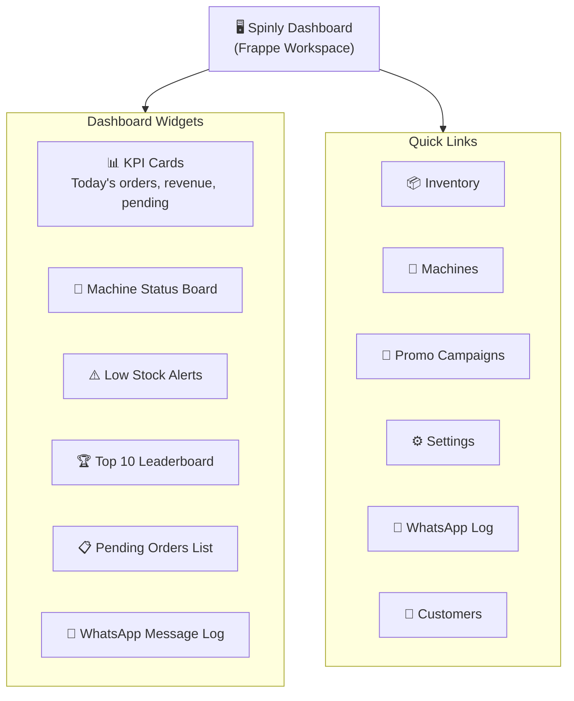

# UI — Configuration & Masters

The Spinly Dashboard is the manager's home in Frappe Desk. It provides at-a-glance operational KPIs and direct links to all management functions.

---

## Manager Dashboard Navigation



---

## KPI Cards

Four cards at the top of the dashboard:

| Card | Value | Source |
|---|---|---|
| Today's Orders | Count of orders where `order_date = today` | Laundry Order |
| Today's Revenue | Sum of `net_amount` for today's paid orders | Laundry Order (payment_status=Paid) |
| Pending Orders | Count of submitted orders not yet Delivered | Laundry Job Card (workflow_state ≠ Delivered) |
| Low Stock Items | Count of consumables below reorder_threshold | Laundry Consumable |

---

## Machine Status Board

Color-coded grid of all machines:

```
┌──────────────────┬──────────────────┬──────────────────┐
│ 🟢 Washer Alpha  │ 🟡 Washer Beta    │ 🟢 Washer Gamma  │
│ MAC-01 · 10 kg   │ MAC-02 · 8 kg     │ MAC-03 · 12 kg   │
│ 0/10 kg load     │ 6/8 kg load       │ 0/12 kg load     │
│ Idle             │ Running · 45 min  │ Idle             │
├──────────────────┼──────────────────┴──────────────────┤
│ 🔴 Dryer Delta   │ 🔴 Washer Epsilon                    │
│ MAC-04 · 10 kg   │ MAC-05 · 8 kg                       │
│ Maintenance Req  │ Out of Order                        │
│ [Mark Idle]      │ [Mark Idle]                         │
└──────────────────┴─────────────────────────────────────┘
```

- **Green** = Idle
- **Yellow** = Running (shows countdown + load)
- **Red** = Maintenance Required / Out of Order
- **[Mark Idle]** button: 1 tap to restore machine to allocation pool

---

## Low Stock Alerts Widget

| Element | Description |
|---|---|
| Row format | `{item_name}: {current_stock} {unit} · threshold: {threshold}` |
| Row style | 🔴 Red background |
| Suggested reorder | Shows `reorder_quantity` as a hint |
| Quick action | [Restock] button → opens new Inventory Restock Log pre-filled |

---

## Top 10 Leaderboard

| Rank | Customer | Monthly Spend | Tier | Action |
|---|---|---|---|---|
| 1 | Priya Sharma | ₹4,200 | 🥇 Gold | [Send VIP 💌] |
| 2 | Rahul Mehta | ₹3,800 | 🥇 Gold | [Send VIP 💌] |
| 3 | Sunita Patel | ₹3,100 | 🥈 Silver | [Send VIP 💌] |
| 4–10 | ... | ... | ... | — |

- [Send VIP 💌] available for top 3 only
- Sends VIP Thank You WhatsApp via `whatsapp_handler.send_vip_thank_you()`

---

## Pending Orders List

Table of all orders in progress:

| Order | Customer | Lot # | Service | ETA | Job Card State |
|---|---|---|---|---|---|
| ORD-2026-00012 | Rahul M. | LOT-2026-00012 | Wash & Iron | 14:30 | Washing |
| ... | ... | ... | ... | ... | ... |

- Sorted by ETA ascending (most urgent first)
- Click row → opens Job Card for that order

---

## Quick Links

| Link | Destination |
|---|---|
| 📦 Inventory | Laundry Consumable list |
| 🔧 Machines | Laundry Machine list |
| 🎁 Promo Campaigns | Promo Campaign list |
| ⚙️ Settings | Spinly Settings form |
| 📱 WhatsApp Log | WhatsApp Message Log list |
| 👥 Customers | Laundry Customer list |

---

## Related
- [[05 - Configuration & Masters/_Index]]
- [[02 - Loyalty & Gamification/UI]]
- [[03 - Inventory/UI]]
- [[04 - Notifications/UI]]
- [[06 - System/Roles & Permissions]]
