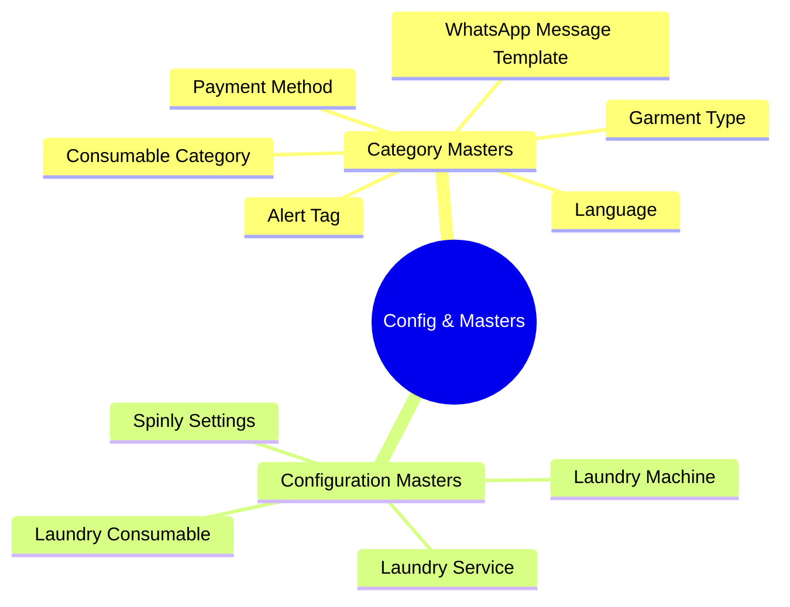

# 05 - Configuration & Masters

The Configuration & Masters module contains all admin-managed data: 6 category masters, 4 configuration masters, and Spinly Settings. The key principle is **zero coding to maintain** — every configurable element is managed via Frappe Desk CRUD.

---

## All 10 DocTypes (Mindmap)

---

## Documents in this Module

| Document | Description |
|---|---|
| [[05 - Configuration & Masters/Data Model]] | All 10 DocType field definitions + seed data |
| [[05 - Configuration & Masters/Business Logic]] | How settings cascade into behavior across all modules |
| [[05 - Configuration & Masters/UI]] | Spinly Dashboard workspace layout + KPIs |
| [[05 - Configuration & Masters/Testing]] | Configurable categories tests + settings toggle tests |

---

## DocType → Where Used → Who Manages

| DocType | Used By | Managed By |
|---|---|---|
| Garment Type | POS Screen 2 icon grid, Order Item | Laundry Manager |
| Alert Tag | POS Screen 2 toggles, Job Tag print | Laundry Manager |
| Payment Method | POS checkout, Laundry Order | Laundry Manager |
| Language | WhatsApp templates, Customer record | Laundry Manager |
| WhatsApp Message Template | All 6 WhatsApp triggers | Laundry Manager |
| Consumable Category | Laundry Consumable grouping | Laundry Manager |
| Laundry Service | ETA engine, Order, Promo Campaign | Laundry Manager |
| Laundry Machine | ETA engine, Job Card | Laundry Manager |
| Laundry Consumable | Deduction logic, Dashboard alerts | Laundry Manager |
| Spinly Settings | All modules (loyalty, ETA, WhatsApp) | System Manager |

---

## No-Code-To-Maintain Principle

All of the following require zero code changes:
- ✅ Add new garment type → appears on POS icon grid
- ✅ Deactivate alert tag → disappears from POS
- ✅ Add new payment method → appears at checkout
- ✅ Add new language + templates → new customers auto-receive in that language
- ✅ Add new promo campaign → auto-applies to qualifying orders
- ✅ Change loyalty points rate → affects all future orders

---

## Related
- [[🏠 Spinly — Master Index]]
- [[📊 DocType Map]]
- [[01 - Order Flow/_Index]]
- [[02 - Loyalty & Gamification/_Index]]
- [[03 - Inventory/_Index]]
- [[04 - Notifications/_Index]]
