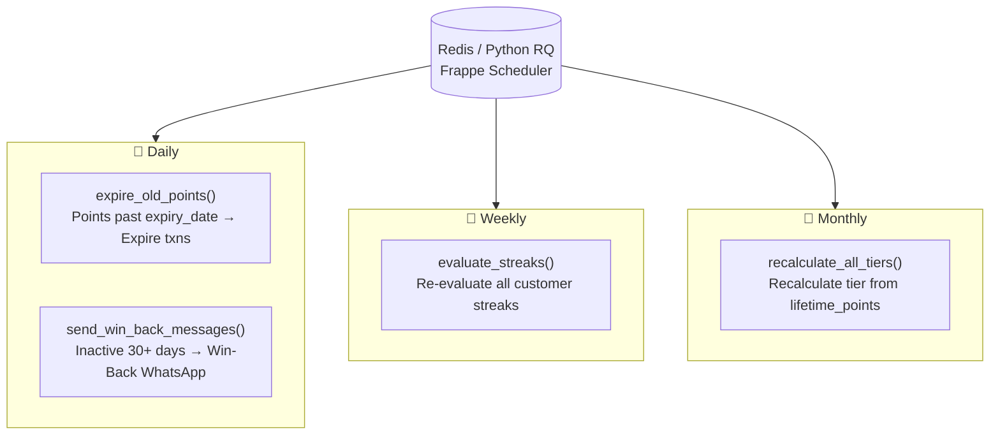
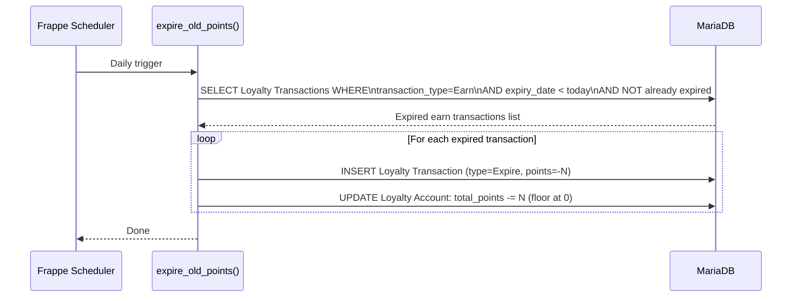
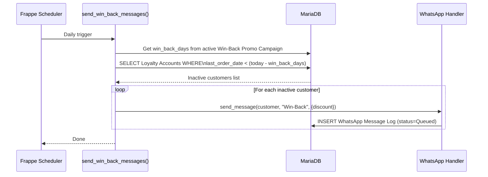

# Background Jobs

Four scheduler jobs run automatically via Frappe's Redis/Python RQ background job system. All are defined in `hooks.py` under `scheduler_events`.

---

## Scheduler Overview



---

## hooks.py Configuration

```python
scheduler_events = {
    "daily": [
        "spinly.logic.loyalty.expire_old_points",
        "spinly.integrations.whatsapp_handler.send_win_back_messages"
    ],
    "weekly": [
        "spinly.logic.loyalty.evaluate_streaks"
    ],
    "monthly": [
        "spinly.logic.loyalty.recalculate_all_tiers"
    ]
}
```

---

## Job 1: expire_old_points() — Daily

**Module:** `spinly/logic/loyalty.py`



**What it does:**
- Finds all Earn transactions past their `expiry_date`
- Creates a matching Expire transaction for each
- Decrements `total_points` on the Loyalty Account (never below 0)
- Does NOT decrement `lifetime_points` — tier is unaffected

---

## Job 2: send_win_back_messages() — Daily

**Module:** `spinly/integrations/whatsapp_handler.py`



**What it does:**
- Reads `win_back_days` from the active Win-Back Promo Campaign (default 30)
- Finds customers who haven't ordered in that many days
- Sends Win-Back WhatsApp (with discount offer) to each
- Creates one WhatsApp Message Log entry per customer

> **Phase 1:** All entries are `Queued`. Phase 2: Actually sent via provider.

---

## Job 3: evaluate_streaks() — Weekly

**Module:** `spinly/logic/loyalty.py`

**What it does:**
- Re-evaluates `current_streak_weeks` for all active customers
- Catch-all for edge cases where real-time streak check (in `earn_points`) may have drifted
- Does not create transactions — only corrects streak counter
- Runs weekly to limit database load

---

## Job 4: recalculate_all_tiers() — Monthly

**Module:** `spinly/logic/loyalty.py`

```python
def recalculate_all_tiers():
    settings = frappe.get_single("Spinly Settings")
    accounts = frappe.get_all("Loyalty Account", fields=["name", "lifetime_points"])
    for account in accounts:
        if account.lifetime_points >= settings.tier_gold_pts:
            tier = "Gold"
        elif account.lifetime_points >= settings.tier_silver_pts:
            tier = "Silver"
        else:
            tier = "Bronze"
        frappe.db.set_value("Loyalty Account", account.name, "tier", tier)
```

**What it does:**
- Recalculates tier for every customer from `lifetime_points`
- Corrects any drift if tier thresholds in Spinly Settings were changed after launch
- Monthly frequency balances accuracy vs DB load (real-time tier updates in `earn_points` handle the day-to-day)

---

## Redis / Python RQ

Frappe's scheduler uses:
- **Redis** — job queue storage
- **Python RQ (Redis Queue)** — job execution workers
- `bench start` in development — starts the scheduler worker process
- Production: supervisor manages the worker process

No custom worker setup needed — Frappe handles it automatically.

---

## Related
- [[06 - System/_Index]]
- [[🔗 Hook Map]]
- [[02 - Loyalty & Gamification/Business Logic]]
- [[04 - Notifications/Business Logic]]
