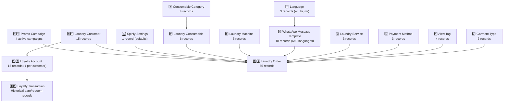

# Mock Data & Fixtures

All fixture data is loaded via `bench migrate` from JSON files in `spinly/fixtures/`. This populates the database with seed data for development, testing, and demonstration.

---

## Fixture Load Order

**Load command:** `bench --site dev.localhost migrate`

---

## Fixture Files

| File | Records | Purpose |
|---|---|---|
| `language.json` | 3 | English, Hindi, Marathi |
| `consumable_category.json` | 4 | Detergent, Softener, Stain Remover, Fabric Conditioner |
| `garment_type.json` | 6 | Shirt, Pants, Saree, Bedding, Jacket, Woolen |
| `alert_tag.json` | 4 | Whites Only, Color Bleed Risk, Delicates, Heavy Soil |
| `payment_method.json` | 3 | Cash, UPI, Card |
| `laundry_service.json` | 3 | Wash & Fold, Wash & Iron, Dry Clean |
| `whatsapp_message_template.json` | 18 | 6 types × 3 languages |
| `laundry_machine.json` | 5 | Alpha–Epsilon with mixed statuses |
| `laundry_consumable.json` | 6 | 3 below threshold |
| `spinly_settings.json` | 1 | Default settings |
| `laundry_customer.json` | 15 | Mixed tiers, birthdays, referrals |
| `loyalty_account.json` | 15 | Pre-seeded with points + streaks |
| `loyalty_transaction.json` | ~80 | Historical earn/redeem records |
| `promo_campaign.json` | 4 | All 4 campaign types |
| `laundry_order.json` | 55 | Active + historical + draft |

---

## Machines (5 records)

| Name | Naming | Capacity | Status | Test Purpose |
|---|---|---|---|---|
| Washer Alpha | MAC-01 | 10 kg | Idle | Normal allocation |
| Washer Beta | MAC-02 | 8 kg | Running (4 kg load) | Queue time testing |
| Washer Gamma | MAC-03 | 12 kg | Idle | Heavy order testing |
| Dryer Delta | MAC-04 | 10 kg | Maintenance Required | Exclusion from pool |
| Washer Epsilon | MAC-05 | 8 kg | Out of Order | Exclusion from pool |

---

## Consumables (6 records — 3 below threshold)

| Item | Stock | Threshold | Status | Consumption/kg |
|---|---|---|---|---|
| Detergent Pro | 4500 ml | 500 ml | ✅ OK | 30 ml |
| Fabric Softener | 380 ml | 400 ml | ⚠️ Low | 10 ml |
| Stain Remover | 1200 ml | 200 ml | ✅ OK | 5 ml |
| Whitener | 150 ml | 200 ml | ⚠️ Low | 8 ml |
| Conditioner Plus | 2000 ml | 300 ml | ✅ OK | 12 ml |
| Dry Clean Solvent | 800 ml | 1000 ml | ⚠️ Low | 50 ml |

---

## Customers (15 records)

| # | Type | Tier | Birthday Flag | Win-Back Flag | Referral |
|---|---|---|---|---|---|
| CUST-00001 | Regular | Bronze | — | — | — |
| CUST-00002 | Regular | Bronze | — | — | — |
| CUST-00003 | Regular | Bronze | — | ⚠️ Inactive 35+ days | — |
| CUST-00004 | Regular | Bronze | — | ⚠️ Inactive 35+ days | — |
| CUST-00005 | Regular | Bronze | — | — | Referred by CUST-00011 |
| CUST-00006 | Frequent | Silver | — | — | — |
| CUST-00007 | Frequent | Silver | 🎂 Birthday this month | — | — |
| CUST-00008 | Frequent | Silver | — | — | — |
| CUST-00009 | Frequent | Silver | — | ⚠️ Inactive 35+ days | — |
| CUST-00010 | Frequent | Silver | — | — | — |
| CUST-00011 | VIP | Gold | — | — | Referred CUST-00005 |
| CUST-00012 | VIP | Gold | 🎂 Birthday this month | — | — |
| CUST-00013 | VIP | Gold | — | — | — |
| CUST-00014 | Referrer | Silver | — | — | Referred CUST-00005 |
| CUST-00015 | Regular | Bronze | — | — | — |

**Summary:**
- 5 Bronze, 5 Silver, 3 Gold
- 2 with birthday in current month (birthday promo test)
- 3 with `last_order_date` > 35 days ago (win-back test)
- 2 with referral relationships (referral bonus test)

---

## Orders (55 records)

| Category | Count | Purpose |
|---|---|---|
| Submitted + active (Job Cards in mixed states) | 20 | Active order testing, workflow progression |
| Paid + Delivered | 30 | Historical data for leaderboard + analytics |
| Drafts | 5 | ETA validation testing (not yet submitted) |
| **Total** | **55** | |

**Distribution:**
- All 3 services represented
- All 6 garment types used
- All 4 alert tag combinations
- 5 orders with loyalty points redeemed
- 3 orders with promo discounts applied (Flash Sale, Weight Milestone, Birthday)
- 2 orders qualifying as scratch card triggers (5th order for their customer)

---

## Promo Campaigns (4 active)

| Campaign | Type | Condition | Discount | Priority |
|---|---|---|---|---|
| Flash Sale — Dry Clean 20% | Flash Sale | Service = Dry Clean, active today | 20% off | 10 |
| 10kg Weight Bonus | Weight Milestone | Order ≥ 10 kg | Free ironing (Free Service) | 7 |
| Win-Back 15% | Win-Back | Inactive 30+ days (scheduler) | 15% off | 5 |
| Refer & Earn | Referral | First order + referred_by set | 50 bonus pts each | — |

---

## WhatsApp Templates (18 records)

6 message types × 3 languages (English, Hindi, Marathi):

| Message Type | en | hi | mr |
|---|---|---|---|
| Order Confirmation | WTPL-01 | WTPL-02 | WTPL-03 |
| Pickup Reminder | WTPL-04 | WTPL-05 | WTPL-06 |
| Payment Thanks | WTPL-07 | WTPL-08 | WTPL-09 |
| Win-Back | WTPL-10 | WTPL-11 | WTPL-12 |
| Scratch Card | WTPL-13 | WTPL-14 | WTPL-15 |
| VIP Thank You | WTPL-16 | WTPL-17 | WTPL-18 |

---

## Related
- [[06 - System/_Index]]
- [[01 - Order Flow/Testing]]
- [[02 - Loyalty & Gamification/Testing]]
- [[03 - Inventory/Testing]]
- [[04 - Notifications/Testing]]
- [[05 - Configuration & Masters/Testing]]
