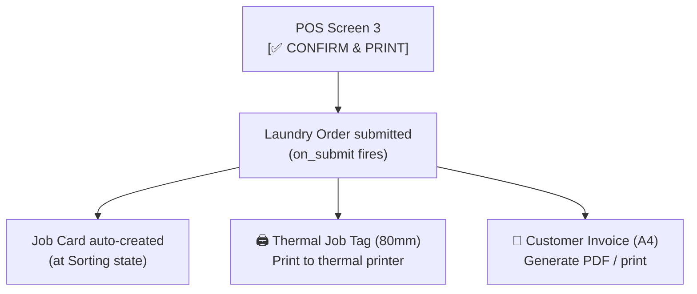

# Print Formats

Two print formats are generated when staff tap **[✅ CONFIRM & PRINT]** on POS Screen 3: a thermal bag tag for the laundry bag, and an A4 invoice for the customer.

---

## Print Trigger Flow



---

## Print Format 1 — Internal Job Tag (Thermal 80mm)

**Template file:** `spinly/print_formats/job_tag.html`
**Paper:** 80mm thermal roll
**Purpose:** Physical bag identification tag — attached to or placed inside the laundry bag

### Layout

```
┌────────────────────────────┐
│   ██ LOT-2026-00012 ██     │  ← Very large font (the primary ID)
│                            │
│   Machine: Washer Alpha    │
│   MAC-01                   │
│                            │
│   ⚠️ WHITES ONLY            │  ← Bold, colored alert badge
│   ⚠️ DELICATES              │  ← Bold, colored alert badge
│                            │
│   Tier: 🥇 GOLD             │  ← Customer tier badge
│                            │
│   Special Instructions:    │
│   "Handle gently"          │
│                            │
│   ☐ Sorting                │  ← Step checklist (staff tick physically)
│   ☐ Washing                │
│   ☐ Drying                 │
│   ☐ Ironing                │
│   ☐ Ready                  │
└────────────────────────────┘
```

### Fields Used

| Field | Source |
|---|---|
| `lot_number` | `Laundry Order.lot_number` |
| Machine name + ID | `Laundry Machine.machine_name` + `name` |
| Alert badges | `Order Alert Tag` child table → `tag_name`, `color_code`, `icon_emoji` |
| Customer tier badge | `Laundry Job Card.customer_tier_badge` |
| Special instructions | `Laundry Job Card.special_instructions` (= order.customer_comments) |
| Step checklist | Static — 5 workflow steps printed as tick boxes |

---

## Print Format 2 — Customer Invoice (A4 PDF)

**Template file:** `spinly/print_formats/customer_invoice.html`
**Paper:** A4
**Purpose:** Customer receipt — given at pickup or sent as PDF

### Layout

```
┌────────────────────────────────────────────────┐
│  SPINLY LAUNDRY                                │
│  Order: ORD-2026-00012    Date: 15 Mar 2026    │
│  Customer: Priya Sharma   Phone: 9876543210    │
├────────────────────────────────────────────────┤
│  ITEMS                                         │
│  Shirt (×3)    0.60 kg    ₹24.00               │
│  Saree (×2)    1.00 kg    ₹40.00               │
│  Bedding (×1)  2.00 kg    ₹80.00               │
├────────────────────────────────────────────────┤
│  Service: Wash & Iron                          │
│  Total Weight: 3.60 kg                         │
│  Subtotal:          ₹216.00                    │
│  Flash Sale (20%):  -₹43.20                    │
│  Net Total:         ₹172.80                    │
├────────────────────────────────────────────────┤
│  ETA: 15 Mar 2026 at 16:30                     │
│  Lot Number: LOT-2026-00012                    │
├────────────────────────────────────────────────┤
│  [QR CODE]  Pay via UPI: spinly@upi            │
│             ₹172.80                            │
├────────────────────────────────────────────────┤
│  Loyalty Points:                               │
│  Earned this order: +86 pts                    │
│  Running balance: 420 pts (₹42 redeemable)     │
│  3/4 weeks — 1 more for double points!         │
└────────────────────────────────────────────────┘
```

### Fields Used

| Section | Field | Source |
|---|---|---|
| Header | `name`, `order_date` | Laundry Order |
| Header | `full_name`, `phone` | Laundry Customer |
| Items | `garment_name`, `quantity`, `weight_kg`, `unit_price`, `line_total` | Order Item child table |
| Summary | `service_name` | Laundry Service |
| Summary | `total_weight_kg`, `total_amount`, `discount_amount`, `net_amount` | Laundry Order |
| ETA | `eta` | Laundry Order (formatted datetime) |
| Lot | `lot_number` | Laundry Order |
| UPI QR | `upi_id` | Spinly Settings → QR generated |
| Loyalty | Points earned this order, `total_points` | Loyalty Transaction + Loyalty Account |
| Streak | `streak_progress_text` | Laundry Order |

---

## Jinja2 Template Rendering

Both templates use Frappe's standard Jinja2 print format system:
- Templates stored in `spinly/print_formats/`
- Accessed via Frappe's Print Format DocType or direct URL
- `frappe.utils.print_format` called from POS JS after order submit

---

## Related
- [[06 - System/_Index]]
- [[01 - Order Flow/UI]]
- [[02 - Loyalty & Gamification/UI]]
- [[05 - Configuration & Masters/Data Model]]
