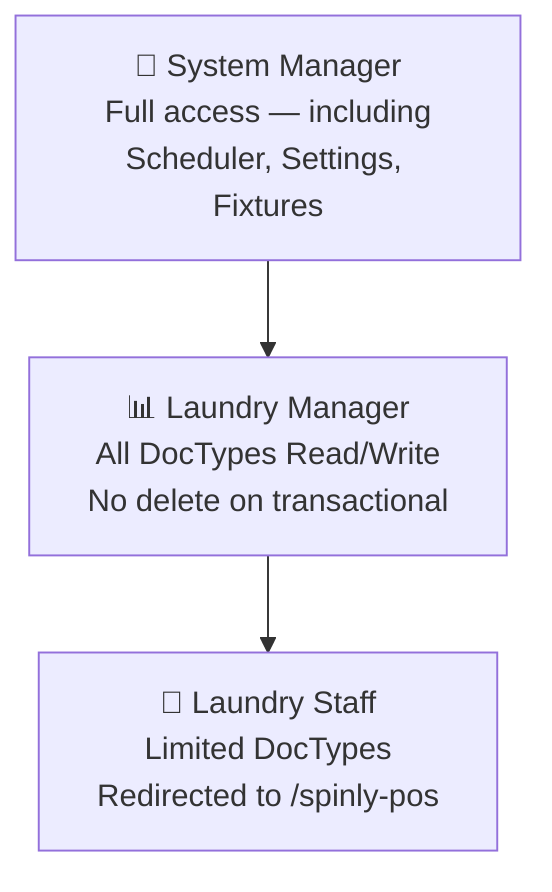

# Roles & Permissions

Three roles cover all system access. Each role maps to a distinct user type with specific DocType permissions and a UI surface.

---

## Role Hierarchy



---

## Per-Role Summary

| Role | UI Surface | Key Restrictions |
|---|---|---|
| **Laundry Staff** | `/spinly-pos` (forced redirect on login) | Cannot access Frappe Desk. No delete. No Settings. |
| **Laundry Manager** | Frappe Desk — Spinly Dashboard | No delete on Laundry Order, Laundry Job Card, Loyalty Transaction. Read-only on Spinly Settings. |
| **System Manager** | Full Frappe Desk | Full access including scheduler logs, fixtures, all settings. |

---

## Permissions Matrix

| DocType | Laundry Staff | Laundry Manager | System Manager |
|---|---|---|---|
| Laundry Customer | Create, Read | Create, Read, Write | Full |
| Laundry Order | Create, Read | Create, Read, Write, Submit | Full |
| Laundry Job Card | Read, Write (workflow) | Create, Read, Write, Submit | Full |
| Loyalty Account | — | Read | Full |
| Loyalty Transaction | — | Read | Full |
| Promo Campaign | — | Create, Read, Write | Full |
| Scratch Card | — | Read | Full |
| WhatsApp Message Log | — | Read | Full |
| Inventory Restock Log | — | Create, Read | Full |
| Laundry Consumable | — | Read, Write | Full |
| Laundry Machine | — | Read, Write | Full |
| Laundry Service | — | Read | Full |
| Garment Type | — | Create, Read, Write | Full |
| Alert Tag | — | Create, Read, Write | Full |
| Payment Method | — | Create, Read, Write | Full |
| Language | — | Create, Read, Write | Full |
| WhatsApp Message Template | — | Create, Read, Write | Full |
| Consumable Category | — | Create, Read, Write | Full |
| Spinly Settings | — | Read | Full |

---

## Staff Login Redirect

When a user with only the **Laundry Staff** role logs in, Frappe redirects them to `/spinly-pos` instead of the Desk. Implementation:

```python
# In hooks.py
on_login = "spinly.auth.redirect_staff_to_pos"

# spinly/auth.py
def redirect_staff_to_pos(login_manager):
    user = frappe.get_doc("User", login_manager.user)
    roles = [r.role for r in user.roles]
    if "Laundry Staff" in roles and "Laundry Manager" not in roles:
        frappe.local.response["redirect_to"] = "/spinly-pos"
```

---

## No-Delete Rule on Transactional DocTypes

**Laundry Manager** cannot delete:
- Laundry Order
- Laundry Job Card
- Loyalty Account
- Loyalty Transaction
- WhatsApp Message Log
- Inventory Restock Log

**Why:** These are audit records. Deleting them would create gaps in the loyalty ledger, order history, and communication log. Only System Manager can delete (for data corrections only).

---

## Anti-Patterns

- ❌ Never give Laundry Staff access to Spinly Settings — they could disable loyalty or change pricing
- ❌ Never give Laundry Staff delete permissions — prevents accidental data loss
- ❌ Never allow Laundry Manager to access ERPNext accounting DocTypes — reinforces no-accounting constraint

---

## Related
- [[06 - System/_Index]]
- [[🏗️ Architecture]]
- [[05 - Configuration & Masters/UI]]
