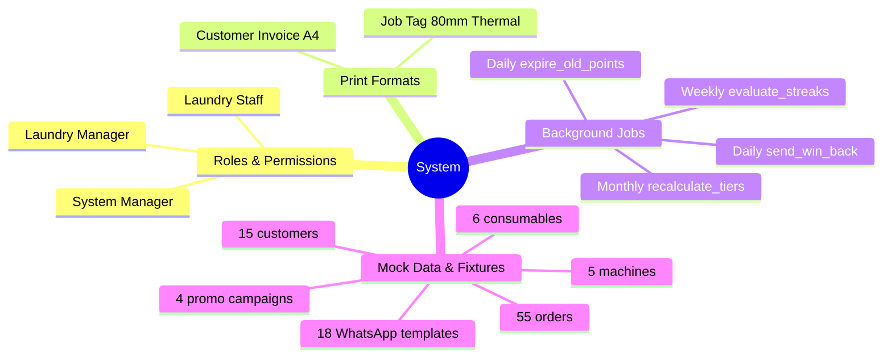

# 06 - System

The System module covers everything that underpins the application but isn't a feature in itself: roles and permissions, print formats, background scheduler jobs, and the mock data fixtures used for testing.

---

## System Overview

---

## Documents in this Module

| Document | Description |
|---|---|
| [[06 - System/Roles & Permissions]] | 3 roles, per-DocType access matrix, redirect on login |
| [[06 - System/Print Formats]] | Job Tag (80mm thermal) + Customer Invoice (A4 PDF) |
| [[06 - System/Background Jobs]] | 4 scheduler jobs: daily/weekly/monthly |
| [[06 - System/Mock Data & Fixtures]] | All fixture data: 15 customers, 55 orders, load order |

---

## Key System Constraints

| Constraint | Detail |
|---|---|
| No accounting | Zero ERPNext accounting DocTypes created — ever |
| No npm/webpack | Staff POS is pure HTML/CSS/JS — no build toolchain |
| No terminal post-launch | All data management via Frappe Desk CRUD |
| No separate customer app | WhatsApp is the loyalty channel |

---

## Related
- [[🏠 Spinly — Master Index]]
- [[🏗️ Architecture]]
- [[🔗 Hook Map]]
