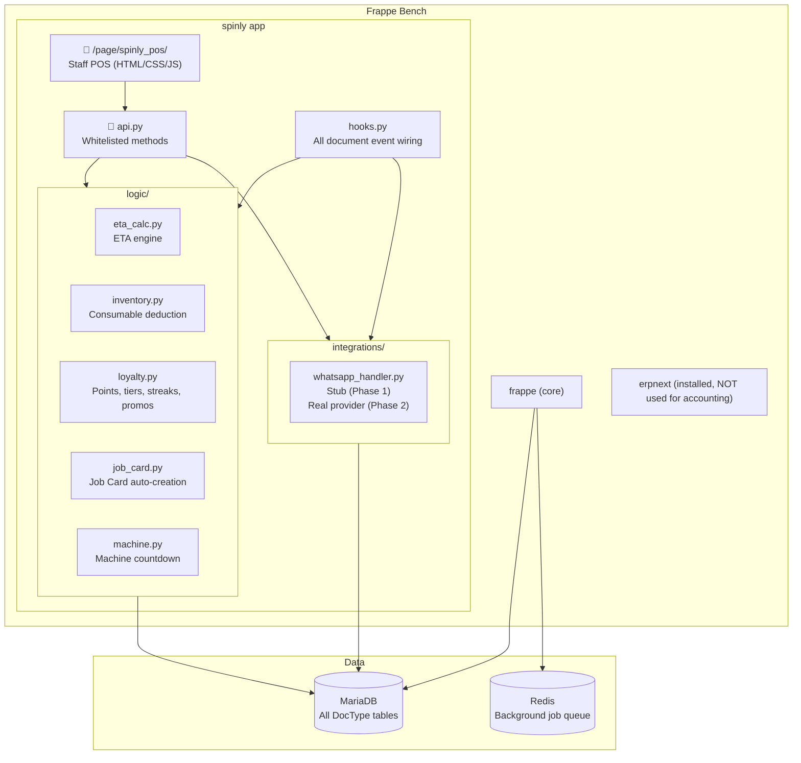

# 🏗️ Architecture

Spinly uses **Approach D: Frappe Pages + Client Scripts** — a single HTML/CSS/JS page for the staff POS and standard Frappe Desk forms for the manager. No npm, no webpack, no build toolchain.

---

## System Topology



---

## Two UI Surfaces

### Staff Surface — `/spinly-pos`
- Single Frappe Page: `spinly/page/spinly_pos/spinly_pos.html`
- Responsive: 10" tablets + 5" phones
- **Thumb-zone layout**: primary actions at bottom of screen
- Color system: Green=Done, Yellow=In Progress, Red=Alert
- No npm, no webpack, no build toolchain — edit one `.html` file

### Manager Surface — Frappe Desk
- Standard DocType list/form views
- Custom Workspace: "Spinly Dashboard" with KPI cards + quick links
- Client Scripts for UX enhancements (no separate frontend repo)

---

## Tech Stack

| Layer | Technology | Maintained by |
|---|---|---|
| Staff POS UI | Single Frappe Page (HTML + CSS + vanilla JS) | Edit one `.html` file |
| Manager UI | Standard Frappe forms + Client Scripts | Browser-based form editor |
| Business Logic | Python (hooks, whitelisted API methods) | Python files |
| Print Formats | Jinja2 HTML templates | Browser-based template editor |
| Background Jobs | Redis / Python RQ | Frappe Scheduler |
| Database | MariaDB (via Frappe DocType system) | Auto-managed |

---

## File Structure

```
spinly/
├── spinly/
│   ├── page/
│   │   └── spinly_pos/
│   │       ├── spinly_pos.html      ← Staff POS UI
│   │       ├── spinly_pos.css
│   │       └── spinly_pos.js
│   ├── logic/
│   │   ├── eta_calc.py              ← ETA + machine allocation
│   │   ├── inventory.py             ← Consumable deduction + restock
│   │   ├── loyalty.py               ← Points, tiers, streaks, promos, scratch cards
│   │   ├── job_card.py              ← Job Card auto-creation from Order
│   │   └── machine.py               ← Machine countdown updates
│   ├── integrations/
│   │   └── whatsapp_handler.py      ← Stub (Phase 1), real provider (Phase 2)
│   ├── api.py                       ← Whitelisted API methods for POS
│   ├── hooks.py                     ← All document event wiring
│   └── doctype/                     ← All 21 DocTypes
│       ├── laundry_customer/
│       ├── laundry_service/
│       ├── laundry_machine/
│       ├── laundry_consumable/
│       ├── spinly_settings/
│       ├── garment_type/
│       ├── alert_tag/
│       ├── payment_method/
│       ├── whatsapp_message_template/
│       ├── language/
│       ├── consumable_category/
│       ├── laundry_order/
│       ├── laundry_job_card/
│       ├── loyalty_account/
│       ├── loyalty_transaction/
│       ├── promo_campaign/
│       ├── scratch_card/
│       ├── whatsapp_message_log/
│       ├── inventory_restock_log/
│       ├── order_item/              ← child
│       └── order_alert_tag/         ← child
├── public/
│   └── print_formats/
│       ├── job_tag.html             ← Thermal 80mm
│       └── customer_invoice.html    ← A4 PDF
└── fixtures/
    ├── garment_type.json
    ├── alert_tag.json
    ├── payment_method.json
    ├── language.json
    ├── consumable_category.json
    ├── laundry_service.json
    ├── laundry_machine.json
    ├── laundry_consumable.json
    ├── whatsapp_message_template.json
    ├── spinly_settings.json
    ├── laundry_customer.json        ← 15 customers
    ├── loyalty_account.json
    ├── loyalty_transaction.json
    ├── laundry_order.json           ← 55 orders
    └── promo_campaign.json
```

---

## Hard Constraints

| Constraint | Implication |
|---|---|
| **No accounting** | Zero Journal Entries, GL Entries, Payment Entries. `discount_amount` field on order only. |
| **Low-click** | Returning customer ≤ 5 taps. New customer ≤ 7 taps. Job Card advance = 1 tap. |
| **No coding to maintain** | Garment types, alert tags, services, promos all managed via Frappe Desk CRUD. |
| **Offline (Phase 2)** | Phase 1 requires stable WiFi. Offline queuing deferred. |

---

## Phase 1 vs Phase 2 Boundary

| Feature | Phase 1 | Phase 2 |
|---|---|---|
| WhatsApp | Stub — logs to DB as `Queued` | Real provider (swap 3 lines in `whatsapp_handler.py`) |
| Offline | Not supported | Offline order queuing |
| Driver Module | Not included | Pickup/delivery routing |
| Customer App | Not included | Self-service app |
| Multi-store | Not included | Multi-store analytics |

---

## Related
- [[🏠 Spinly — Master Index]]
- [[🔗 Hook Map]]
- [[📊 DocType Map]]
- [[06 - System/Roles & Permissions]]
