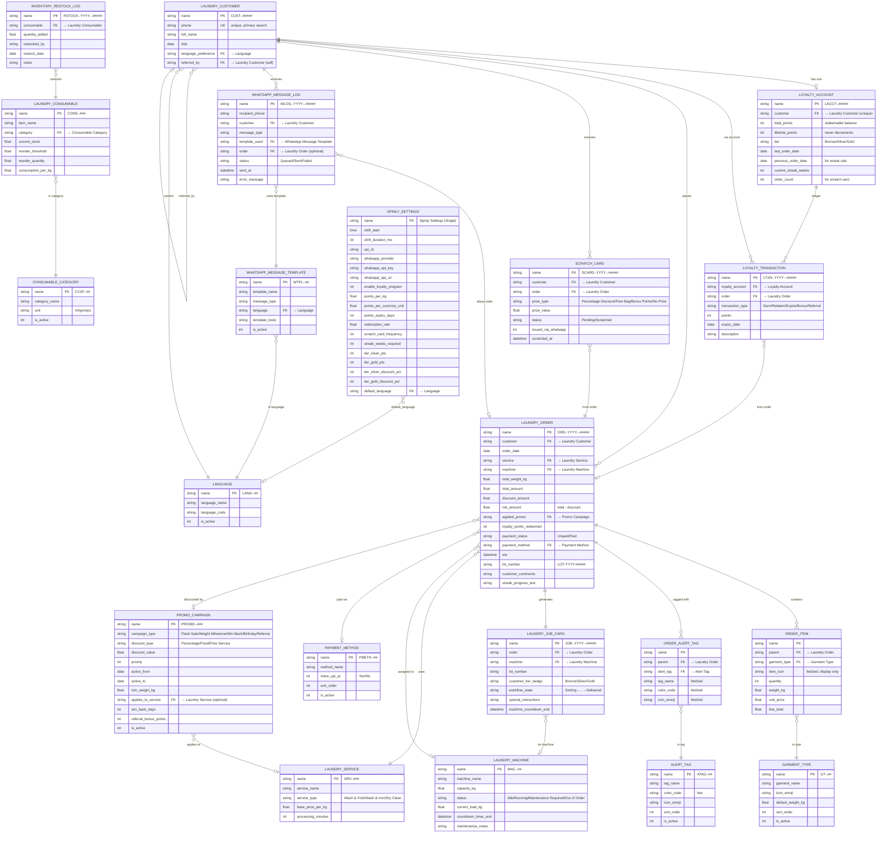

# 📊 DocType Map

All 21 DocTypes + 2 child tables in Spinly. Every DocType is managed by Frappe's schema engine — no manual SQL migrations required.

---

## Complete ER Diagram

---

## DocType Summary Table

| DocType | Naming Series | Category | Module |
|---|---|---|---|
| Garment Type | `GT-.##` | Category Master | Config & Masters |
| Alert Tag | `ATAG-.##` | Category Master | Config & Masters |
| Payment Method | `PMETH-.##` | Category Master | Config & Masters |
| WhatsApp Message Template | `WTPL-.##` | Category Master | Notifications |
| Language | `LANG-.##` | Category Master | Config & Masters |
| Consumable Category | `CCAT-.##` | Category Master | Inventory |
| Laundry Service | `SRV-.###` | Configuration Master | Config & Masters |
| Laundry Machine | `MAC-.##` | Configuration Master | Config & Masters |
| Laundry Consumable | `CONS-.###` | Configuration Master | Inventory |
| Spinly Settings | `Single` | Configuration Master | Config & Masters |
| Laundry Customer | `CUST-.#####` | CRM Master | Order Flow |
| Laundry Order | `ORD-.YYYY.-.#####` | Transactional (Submittable) | Order Flow |
| Laundry Job Card | `JOB-.YYYY.-.#####` | Transactional (Submittable) | Order Flow |
| Loyalty Account | `LACCT-.#####` | Transactional | Loyalty |
| Loyalty Transaction | `LTXN-.YYYY.-.#####` | Transactional | Loyalty |
| Promo Campaign | `PROMO-.###` | Gamification | Loyalty |
| Scratch Card | `SCARD-.YYYY.-.#####` | Gamification | Loyalty |
| WhatsApp Message Log | `WLOG-.YYYY.-.#####` | Log / Audit | Notifications |
| Inventory Restock Log | `RSTOCK-.YYYY.-.#####` | Log / Audit | Inventory |
| Order Item | *(child of Laundry Order)* | Child Table | Order Flow |
| Order Alert Tag | *(child of Laundry Order)* | Child Table | Order Flow |

---

## Relationship Narrative

- **Laundry Customer** is the root entity. Every order, loyalty account, scratch card, and WhatsApp message traces back to a customer.
- **Loyalty Account** is 1-to-1 with Laundry Customer (unique constraint). It is the running ledger head; individual transactions are in **Loyalty Transaction**.
- **Laundry Order** is the primary transactional document. It links to Customer, Service, Machine, Payment Method, and a Promo Campaign. It has two child tables (Order Item, Order Alert Tag).
- **Laundry Job Card** is auto-created from Laundry Order on submit. 1-to-1 with an order.
- **Promo Campaign** is self-contained — it defines the rules. The discount result is stored only on `Laundry Order.discount_amount` (never in accounting).
- **Scratch Card** is created by the loyalty engine when `order_count % scratch_card_frequency == 0`.
- **WhatsApp Message Log** records every send attempt. In Phase 1 all entries are `Queued`.
- **Inventory Restock Log** auto-increments `Laundry Consumable.current_stock` on insert.

---

## Related
- [[🏠 Spinly — Master Index]]
- [[🔗 Hook Map]]
- [[01 - Order Flow/Data Model]]
- [[02 - Loyalty & Gamification/Data Model]]
- [[03 - Inventory/Data Model]]
- [[04 - Notifications/Data Model]]
- [[05 - Configuration & Masters/Data Model]]
