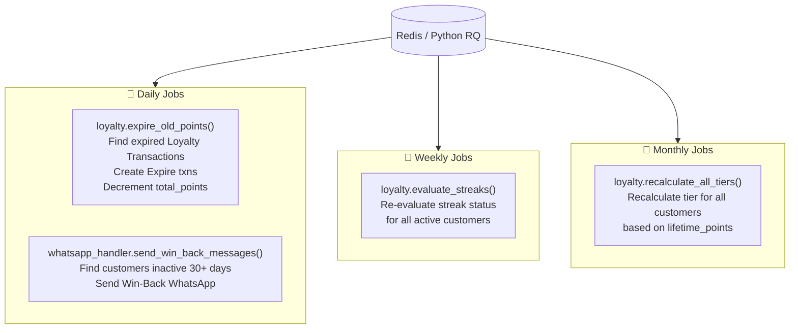

# 🔗 Hook Map

All document events and scheduler jobs wired in `spinly/hooks.py`. This is the single source of truth for when every piece of logic fires.

---

## Document Events — Execution Flow

```mermaid
sequenceDiagram
    participant User
    participant LC as Laundry Customer
    participant LO as Laundry Order
    participant LJC as Laundry Job Card
    participant IRL as Inventory Restock Log

    User->>LC: Insert new customer
    LC->>LC: after_insert
    LC-->>+: loyalty.create_loyalty_account()

    User->>LO: Save order (draft)
    LO->>LO: before_save
    LO-->>+: eta_calc.calculate()
    LO-->>+: loyalty.apply_best_discount()

    User->>LO: Submit order
    LO->>LO: on_submit
    LO-->>+: job_card.create_from_order()
    LO-->>+: loyalty.earn_points()
    LO-->>+: whatsapp_handler.send_order_confirmation()

    User->>LO: Mark as Paid
    LO->>LO: on_update
    LO-->>+: whatsapp_handler.on_payment_confirmed()
    Note over LO: Guard: fires ONLY on Unpaid→Paid transition

    User->>LJC: Submit Job Card
    LJC->>LJC: on_submit
    LJC-->>+: inventory.deduct_consumables()

    User->>LJC: Advance to Running
    LJC->>LJC: on_update (→Running)
    LJC-->>+: machine.update_countdown()

    User->>LJC: Advance to Ready
    LJC->>LJC: on_update (→Ready)
    LJC-->>+: whatsapp_handler.send_pickup_reminder()
    LJC-->>+: loyalty.issue_scratch_card()

    User->>IRL: Insert restock record
    IRL->>IRL: after_insert
    IRL-->>+: inventory.apply_restock()
```

---

## Scheduler Events



---

## Complete Hook Reference Table

| DocType | Event | Function | Purpose |
|---|---|---|---|
| Laundry Customer | `after_insert` | `loyalty.create_loyalty_account` | Auto-create Loyalty Account (with uniqueness guard) |
| Laundry Order | `before_save` | `eta_calc.calculate` | Assign machine + calculate ETA |
| Laundry Order | `before_save` | `loyalty.apply_best_discount` | Find best active promo, set discount_amount |
| Laundry Order | `on_submit` | `job_card.create_from_order` | Auto-create Job Card at Sorting state |
| Laundry Order | `on_submit` | `loyalty.earn_points` | Award points, update tier, check streak, referral |
| Laundry Order | `on_submit` | `whatsapp_handler.send_order_confirmation` | Queue Order Confirmation WhatsApp |
| Laundry Order | `on_update` | `whatsapp_handler.on_payment_confirmed` | Queue Payment Thanks (Unpaid→Paid guard) |
| Laundry Job Card | `on_submit` | `inventory.deduct_consumables` | Deduct consumable stock per kg processed |
| Laundry Job Card | `on_update` | `machine.update_countdown` | Set machine countdown_timer_end (on →Running) |
| Laundry Job Card | `on_update` | `whatsapp_handler.send_pickup_reminder` | Queue Pickup Reminder (on →Ready) |
| Laundry Job Card | `on_update` | `loyalty.issue_scratch_card` | Issue Scratch Card if order_count % frequency == 0 (on →Ready) |
| Inventory Restock Log | `after_insert` | `inventory.apply_restock` | Auto-increment Laundry Consumable.current_stock |

---

## hooks.py Source

```python
doc_events = {
    "Laundry Customer": {
        "after_insert": "spinly.logic.loyalty.create_loyalty_account"
    },
    "Laundry Order": {
        "before_save": [
            "spinly.logic.eta_calc.calculate",
            "spinly.logic.loyalty.apply_best_discount"
        ],
        "on_submit": [
            "spinly.logic.job_card.create_from_order",
            "spinly.logic.loyalty.earn_points",
            "spinly.integrations.whatsapp_handler.send_order_confirmation"
        ],
        "on_update": "spinly.integrations.whatsapp_handler.on_payment_confirmed"
        # Guard inside on_payment_confirmed:
        #   if doc.payment_status == "Paid" and
        #      doc.get_doc_before_save().payment_status != "Paid":
        #       send_payment_thanks()
    },
    "Laundry Job Card": {
        "on_submit": "spinly.logic.inventory.deduct_consumables",
        "on_update": [
            "spinly.logic.machine.update_countdown",       # on workflow_state → Running
            "spinly.integrations.whatsapp_handler.send_pickup_reminder",  # on → Ready
            "spinly.logic.loyalty.issue_scratch_card",    # on → Ready
        ]
    },
    "Inventory Restock Log": {
        "after_insert": "spinly.logic.inventory.apply_restock"
    }
}

scheduler_events = {
    "daily": [
        "spinly.logic.loyalty.expire_old_points",
        "spinly.integrations.whatsapp_handler.send_win_back_messages"
    ],
    "weekly": [
        "spinly.logic.loyalty.evaluate_streaks"
    ],
    "monthly": [
        "spinly.logic.loyalty.recalculate_all_tiers"
    ]
}
```

---

## Critical Rules

> **Hooks must NEVER create:** Journal Entries, GL Entries, Payment Entries, or any ERPNext accounting documents. Discounts are stored as `discount_amount` on the order only.

> **on_payment_confirmed** fires on every `Laundry Order.on_update`. The internal guard ensures the WhatsApp fires only once — on the `Unpaid → Paid` transition.

> **Streak check** happens in `earn_points()` on Order submit — NOT on Job Card delivery. This is intentional.

> **Scratch card check** happens on Job Card `on_update → Ready`. By this time `order_count` is already incremented (set during `earn_points` on Order submit earlier in the flow).

---

## Related
- [[🏠 Spinly — Master Index]]
- [[🏗️ Architecture]]
- [[01 - Order Flow/Business Logic — ETA & Machine Allocation]]
- [[01 - Order Flow/Business Logic — Job Card Lifecycle]]
- [[02 - Loyalty & Gamification/Business Logic]]
- [[03 - Inventory/Business Logic]]
- [[04 - Notifications/Business Logic]]
- [[06 - System/Background Jobs]]
